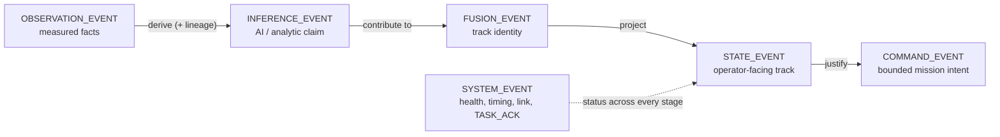

# ZMeta Specification (v1.0 Locked, current release v1.1.18)

**Adapt a sensor to ZMeta once, and it speaks to everything ZMeta maps — no
N×N point-to-point bridges.** ZMeta is a free, open, transport-agnostic
semantic standard for resilient ISR: one honest event model that heterogeneous
sensors, analytics, gateways, TAK clients, and mission systems can share
without silently changing what the data means.


### Why you should care

- **Integrate once, not per pair.** Ten sensors and five consumers is fifty
  brittle bridges — or fifteen adapters to one contract. Adapters are the
  bounded work: writing one against `adapters/AUTHORING.md` is a
  single-sitting task, and the repo ships worked references to copy.
- **Honesty is enforced, not promised.** Uncertainty, provenance, lineage, and
  timing quality travel *with* the data and are machine-checked. Degraded,
  stale, or externally promoted data cannot be made to look clean — the
  consumer adjudicates truth, never a black box.
- **Built for the bad link.** Three export profiles thin data for bandwidth
  without changing meaning; a Profile L state event fits in a tactical packet
  budget (see the size comparison below).
- **Layers keep their authority.** A line of bearing is not a track; a track
  is not a command basis. Those distinctions are checkable, which is what
  makes automated retasking auditable instead of hopeful.
- **Nothing is locked to a vendor, a transport, or us.** Apache-2.0, a locked
  v1.0 kernel, and governed change process — see `IP_POLICY.md`.

### The semantic pipeline

Each transition is a deliberate, evidence-bearing promotion: data moves to a
higher-authority lane only when lineage, timing, and confidence support it.



### Small enough for the tactical link


The same Profile L `STATE_EVENT` across four wire formats — every one decodes
back to the identical canonical JSON. Encoding never creates authority: a
compact packet is valid only if the decoded event passes the same schema,
policy, and conformance checks a JSON event does.

**→ The full picture in one document: [`docs/zmeta_professional_overview.md`](docs/zmeta_professional_overview.md)**
— architecture, the six event families, adapters, gateway deployment, risk
adjudication, AI provenance, and worked operational scenarios (RF detection
through automated retasking, multi-node geolocation, GPS-denied operation).
Start there if you are evaluating ZMeta rather than building against it.

## ZMeta In The Field

The reference stack is extracted from fielded deployments, not designed on
paper. The ingress adapters marked "Production" in `adapters/README.md` came
from:

- a hosted EO/CV integration deployment: fixed-camera detections build a full
  local `OBSERVATION -> INFERENCE -> FUSION -> STATE` chain on the edge,
  publish only validated `STATE_EVENT`s to a hosted control plane, render on
  a live operator map, and project to TAK/ATAK as honest CoT through a
  governed egress path;
- mobile RF direction-finding deployments: KrakenSDR coherent DoA, Moth
  RF-over-MAVLink, and SignalHunter PSD-sweep sensors feeding RF
  `OBSERVATION_EVENT` lines of bearing into downstream fusion.

Deployment reports — what mapped cleanly and what did not — are the
standard's primary evidence stream (see the promotion evidence bar in
`spec/extension-registry.md`). Open a deployment field report issue to
contribute one.

## What ZMeta Is
- A semantic contract
- A JSON schema
- A policy-driven enforcement model
- A reference gateway and adapters

## What ZMeta Is Not
- Not a transport
- Not a C2 system
- Not a video container
- Not a replacement for MISB

ZMeta does not replace CoT, MAVLink, JREAP, MISB, or vendor sensor formats. It
gives them a shared vocabulary for what was observed, what was inferred, what
was fused, what an operator should see, and what mission intent is being
requested.

## Design Goals
- Honesty under uncertainty
- Graceful degradation
- Operator trust
- Interoperability across vendors and transports

## See It Work In Ten Minutes

Prereq: Python 3.11+ (no Docker needed for this path).

> **Windows users:** enable long-path support once before cloning —
> `git config --global core.longpaths true`. Without it, a clone into an
> already-deep directory can fail checkout with `Filename too long` (Windows'
> 260-character limit), which looks like a broken repository but is not.

```
python -m pip install -r requirements.txt

# terminal 1: reference gateway (schema + policy enforcement)
python tools/run_gateway.py --profile H

# terminal 2: watch validated output arrive
python tools/udp_receiver.py --host 127.0.0.1 --port 5556

# terminal 3: replay a real OBSERVATION -> INFERENCE -> FUSION -> STATE chain
python tools/replay.py --file examples/zmeta-examples-1.0.jsonl --host 127.0.0.1 --port 5555
```

Then validate events of your own against the locked contract:

```
python tools/validate.py --file <your-events>.jsonl --profile H --strict
```

### Prerequisites and the fuller walkthrough

The path above needs only Python 3.11+. For the Docker gateway, encodings, and
CoT emission, install the dev extras and follow the full walkthrough:

```
python -m pip install -r requirements-dev.txt
```

Windows Docker note: Docker Desktop requires virtualization + WSL2 enabled. If
Docker is not available, run the gateway directly with Python as shown above.

See `spec/quickstart.md` for the runnable gateway + UDP replay walkthrough, and
`docs/zmeta_two_node_quickstart.md` to deploy sensor-edge-to-COP across two
nodes.

## Start Here By Role

- **Building an adapter** (your sensor or format -> ZMeta): read
  `adapters/AUTHORING.md`, then copy the worked exercise in
  `adapters/ingress/example-vendor/` and the worked chains in
  `examples/zmeta-examples-1.0.jsonl` (RF) and
  `examples/zmeta-eo-chain-examples.jsonl` (EO).
- **Integrating or deploying**: `spec/installation-guide.md` for a
  step-by-step install, `spec/quickstart.md` for the developer walkthrough,
  and the Deployment Checklist below for drift-locked production setups.
- **Evaluating the standard**: start with
  [`docs/zmeta_professional_overview.md`](docs/zmeta_professional_overview.md)
  — the single document that explains the whole stack, with diagrams and
  worked scenarios — then `spec/semantics-contract.md` (normative),
  `spec/profile-compatibility.md`, and `CONFORMANCE.md`.
- **Building UIs or consumers**: `spec/field-dictionary.md`; encoding
  guidance in `spec/compact-binary-mapping.md` and
  `spec/protobuf-encoding.md`.
- **Contributing, agents, and maintainers**: `AGENTS.md` and
  `docs/zmeta_change_governance.md` before changing governed artifacts;
  `CONTRIBUTING.md` for contribution terms.
- **Industry reviewers**: `IP_POLICY.md`, `CONFORMANCE.md`, `TRADEMARK.md`,
  and `docs/zmeta_defensive_publication.md` before relying on compatibility,
  contribution, or public-sharing claims.
- **Downstream clone users**: read the downstream clone limits in `AGENTS.md`
  and `docs/zmeta_change_governance.md` before altering schema, semantics,
  policy authority, or event vocabulary.

## Current Release

- Current release: `v1.1.18`
- Release notes and assets: <https://github.com/JTC-byte/zmeta-spec/releases/tag/v1.1.18>
- Release focus: **deployment readiness.** A working reference ingress
  adapter for real RF capture data (`adapters/ingress/bladerf/`), the
  gateway container verified on x86-64 and ARM64 with byte-identical
  contract hashes, a two-node sensor-edge-to-COP quickstart
  (`docs/zmeta_two_node_quickstart.md`), a deployment-asserted CoT
  pedigree knob so TAK can receive `<precisionlocation>` detail without
  anything being fabricated, and the command-evidence gate
  (`policy/command-evidence.yaml`) that lets an operator's retasking
  automation cite the fused track it acted on — and lets the gateway
  refuse when that evidence was never permitted to justify a command.
  Ships with v1.1.17's honesty hardening (the compact fail-closed value
  model, the `TIME_STATUS.state` enum, the timestamp and CBOR-envelope
  seams). The locked v1.0 kernel is unchanged.
- Normative contract: v1.0 locked semantic contract, canonical version-discriminated
  JSON schema, v1.0 JSON schema, and policy pack.
- Experimental extension: `schema/zmeta-event-1.1.0.schema.json` is provided for proposed
  compatibility testing only; v1.1.0-only fields are not part of the locked v1.0 contract.

## v1.1.18 Integration Notes

- **Nothing previously valid becomes invalid.** v1.0 and v1.1.0
  producers and consumers need no change.
- **Deploying two nodes:** start at `docs/zmeta_two_node_quickstart.md`.
  It carries the port topology (both gateways listen on 5555; 5556 is
  each gateway's own local-consumer forward — the transposition that
  silently drops traffic), the five-minute wire check, and the rule that
  the four startup hash lines must match across nodes.
- **To see error ellipses on TAK**, the deployment must assert its
  position-source pedigree in the gateway config's `cot.config` block
  (`geopointsrc` / `altsrc` / `how`). Unasserted means omitted:
  `<precisionlocation>` detail and the `how` attribute are never stamped
  from a source the event did not claim.
- **`policy/command-evidence.yaml` is new and optional.** An absent file
  is a legal deployment and the shipped defaults refuse nothing that was
  previously accepted — a direct operator command with no cited parents
  stays legal. Deployments gating *automations* set `require_evidence`.
- **Writing an adapter:** `adapters/AUTHORING.md`, with
  `adapters/ingress/bladerf/` as the worked RF reference against a real
  capture corpus and `adapters/ingress/example-vendor/` as the teaching
  one. `tools/lint_adapter_vocabularies.py` holds adapter vocabulary
  mirrors to the governed schema enums.
- **CBOR wire peers:** datagrams that previously decoded differently
  depending on which CBOR library an install happened to have — tagged,
  value-shared, over-deep, or over-expanding — now refuse identically
  with explicit diagnostics, on both the compact and plain-`cbor`
  envelopes.
- **v1.1.0 `TIME_STATUS` producers:** `payload.state` is now
  enum-constrained (`LOCKED`/`HOLDOVER`/`UNSYNCED`/`UP`/`DEGRADED`/
  `DOWN`). Map or omit values outside it. The locked v1.0 branch is
  unchanged.
- `tools/check_compat.py` gains the `v1.1.18` target; current-facing
  docs re-baseline to the v1.1.18 release manifest.

Integration notes for earlier releases (v1.1.11 through v1.1.16) are in
[`CHANGELOG.md`](CHANGELOG.md), alongside the full change history for
each version.

## Repository Structure
- `spec/` Core specification and normative text.
- `schema/` JSON schema definitions for ZMeta artifacts.
- `examples/` Sample payloads and usage patterns.
- `conformance/` Must-pass/must-fail regression corpus.
- `policy/` Policy language and enforcement guidance.
- `gateway/` Reference gateway implementation and tests.
- `adapters/` Ingress and egress adapter patterns and templates.
- `tools/` Utilities for validation and development workflows.
- `docs/` Advisory guidance plus maintainer process records — see
  `docs/README.md` for which is which.
- `AGENTS.md`, `docs/zmeta_change_governance.md` Human and AI agent change
  governance, process limits, documentation requirements, and release workflow.

## Adapters

Reference adapters show how to translate between ZMeta and external systems.
See `adapters/README.md` for ingress templates, mapping packs, and egress
projections, and `adapters/AUTHORING.md` for the step-by-step authoring guide.

Adapter semantic mapping:
- Native sensor measurements map to `OBSERVATION_EVENT`.
- Classifier or detector output maps to `INFERENCE_EVENT`.
- Track association and identity creation map to `FUSION_EVENT`.
- Operator display projection maps to `STATE_EVENT`.
- Mission tasking maps to `COMMAND_EVENT` only through deconfliction.
- Health, timing, link, validation, and task acknowledgement reports map to `SYSTEM_EVENT`.

ZMeta is strict about semantic invariants and flexible through ignorable,
namespaced, non-semantic extensions. Extensions must not redefine core event
meaning, authority boundaries, units, lineage, profile behavior, or command
safety.

## Schemas and Examples

Use `schema/zmeta-event.schema.json` as the canonical validation entry point.
It dispatches by `zmeta_version` and prevents v1.1.0 vocabulary from validating
under a v1.0 event. Version-specific wrappers are retained for integrations that
need a fixed target:
- `schema/zmeta-event-1.0.schema.json`
- `schema/zmeta-event-1.1.0.schema.json`

Runnable examples live in `examples/`:
- `zmeta-examples-1.0.jsonl`: RF observation, inference, fusion, and state projection.
- `zmeta-eo-chain-examples.jsonl`: worked EO full chain with genuine chained lineage.
- `zmeta-profile-L-examples.jsonl`: Profile L state/system/command examples.
- `zmeta-command-examples.jsonl`: GOTO and TASK_ACK lifecycle.
- `zmeta-v1.1-examples.jsonl`: SENSOR_STATUS, PLATFORM_STATUS, data_ref/data_refs,
  error_ellipse_m, and v1.1.0 tasking examples.

Intentionally invalid examples live in `conformance/must-fail.jsonl`; valid
regression fixtures live in `conformance/must-pass.jsonl`.

## Tools

Quick helpers for local validation and UDP replay:

```
python tools/run_gateway.py --profile H
python tools/udp_receiver.py
python tools/udp_sender.py --file examples/zmeta-command-examples.jsonl
python tools/replay.py --file examples/zmeta-command-examples.jsonl --delay-ms 200
python tools/check_compat.py legacy-events.jsonl --target v1.1.18
python tools/validate.py --file examples/zmeta-command-examples.jsonl --profile H
python tools/check_adapter.py --events my-adapter-output.jsonl --fixtures my-fixtures.jsonl
python tools/validate_conformance.py --strict
python tools/validate_release_manifest.py --manifest release/zmeta-release-manifest.yaml
python tools/validate_release_package.py --manifest release/zmeta-release-manifest.yaml --templates-only
python tools/compute_contract_hash.py
python tools/test_gateway_live.py
python tools/test_workflow_end_to_end.py
```

End-to-end workflow variants:
```
python tools/test_workflow_end_to_end.py --profile M
python tools/test_workflow_end_to_end.py --profile L
python tools/test_workflow_end_to_end.py --profile M --expect COMMAND_EVENT,SYSTEM_EVENT
```

`tools/test_gateway_live.py` exercises live UDP forwarding, COMMAND dedupe, and CoT emission.

Makefile targets run the same commands with `python` directly; ensure dependencies are installed
(`python -m pip install -r gateway/requirements.txt -r requirements-dev.txt`).

## Versioning
- v1.0.x = clarifications and fixes
- v1.1+ = proposed backward-compatible extensions until explicitly locked
- v2.0 = breaking changes

See `spec/versioning.md` for the full policy.

## Installation and Packaging

See `spec/installation-guide.md` for a deterministic install guide, gateway wizard,
and mapping pack installs for drone and sensor configs.

Timing quality metadata (`time_source`, `sync_state`, `est_error_ms`,
`last_sync_ts`) is required by the semantic contract for operational events.
Gateway `event.t_receive` / `event.t_publish` stamps are separate latency and
AAR fields added by the reference gateway when configured.
Adapter fallback timing (`UNKNOWN` / `UNSYNCED`) is intentionally degraded and
should be replaced by source-provided GPS/NTP/PTP timing or periodic
`TIME_STATUS` as soon as a deployment can expose it.

Deployment helpers:
- Config templates: `configs/edge-config.json`, `configs/gateway-config.json`
- Docker Compose: `deploy/edge/docker-compose.yml`, `deploy/gateway/docker-compose.yml`
- Bundle builders:
    - `python release/build_mvp_packages.py --version v1.1.18` produces `zmeta-edge-v1.1.18.zip` and `zmeta-gateway-v1.1.18.zip`
    - `python release/build_release_bundle.py --version 1.1.18` produces `zmeta-v1.1.18-dist.zip`
    - `python tools/build_release_package.py --manifest release/zmeta-release-manifest.yaml --output-dir release/package-v1.1.18 --release-id zmeta-v1.1.18 --release-state formal_release --no-signatures --release-notes release/RELEASE_NOTES_v1.1.18.md` builds formal package metadata without creating signatures. `--release-notes` is mandatory for `formal_release`: omit it and the unpopulated notes template is copied verbatim, which `tools/validate_release_package.py` refuses with `RELEASE_PACKAGE_NOTES_PLACEHOLDER`.
    - `python release/sign_release_artifacts.py --version v1.1.18 --write-checksums --sign --target all` signs release assets with detached PGP signatures when an approved signing key is available.

## Deployment Checklist (Compact)

Use this to lock down schema, policy, and semantic-contract drift and verify a clean deployment:

1. Compute schema, policy, semantic-contract, and combined contract hashes: `python tools/compute_contract_hash.py`
1. Set `require_contract_hash` (and optionally `require_schema_hash`/`require_policy_hash`) in config.
1. If adopting a policy variant into the active `policy/` directory, recompute and update the deployment hash gates.
1. Validate the governed release baseline: `python tools/validate_release_manifest.py --manifest release/zmeta-release-manifest.yaml`
1. Validate formal release package templates or generated package output before distribution.
1. Run self-test: `python tools/run_gateway.py --profile H --self-test`
1. Run conformance: `python tools/validate_conformance.py --strict --profile-projection --extension-registry --conformance-classes --encoding-negative --precision-policy --release-manifest --release-package --bad-events --adapter-harness`
1. Verify consumer risk posture where needed: `python tools/filter_risk.py --input gateway-output.jsonl --preset command --fail-on-drop`
1. Start gateway with strict mode (optional): `python tools/run_gateway.py --config configs/gateway-config.json --strict-validation`
1. Verify metrics and drops in logs (enable `metrics_log_path` if needed).

Before publishing changes to the repository itself, follow
`docs/zmeta_change_governance.md`; release publication additionally requires
`RELEASE_CHECKLIST.md`.

## Normative vs Reference

Normative (contract): `spec/semantics-contract.md`, `schema/zmeta-event.schema.json`, `schema/zmeta-event-1.0.schema.json`, `policy/*.yaml`, `spec/versioning.md`
Reference: `gateway/*`, `tools/*`, `adapters/*`, `examples/*`

Normative files define compliance. Reference components exist to accelerate adoption.

## Industry Sharing And IP Posture

ZMeta is published under Apache License 2.0 as an open specification and
reference stack. For broad industry conversations, cite the public repository,
a tagged release, release notes, release manifest hashes, conformance evidence,
and `docs/zmeta_defensive_publication.md`. Avoid privately disclosing
unpublished roadmap concepts, future vocabulary, or deployment-specific
mappings before they are public or covered by an appropriate agreement.

`IP_POLICY.md`, `CONTRIBUTING.md`, `CONFORMANCE.md`, and `TRADEMARK.md` define
the project's advisory posture for contributor authority, private dialects,
conformance claims, and use of the ZMeta name. These documents are project
governance, not legal advice or a formal standards-body patent policy.
