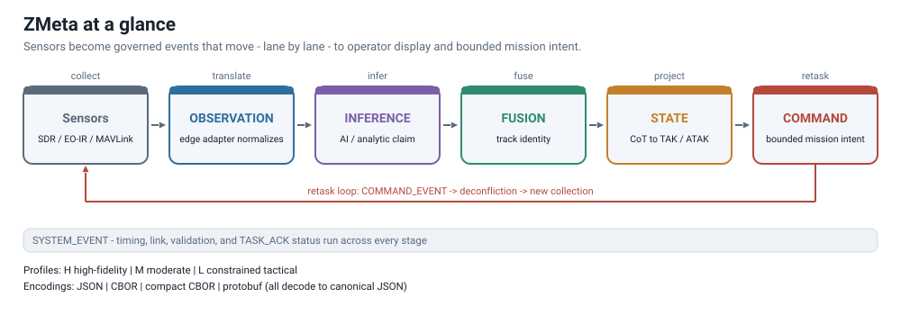
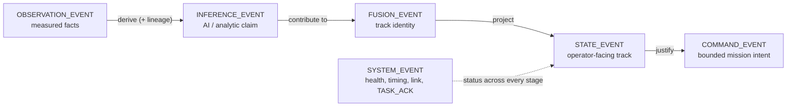
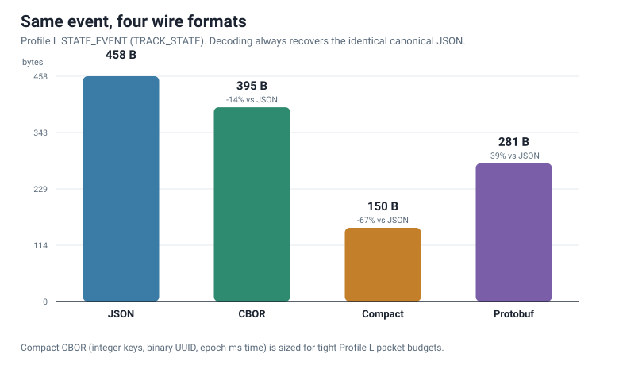
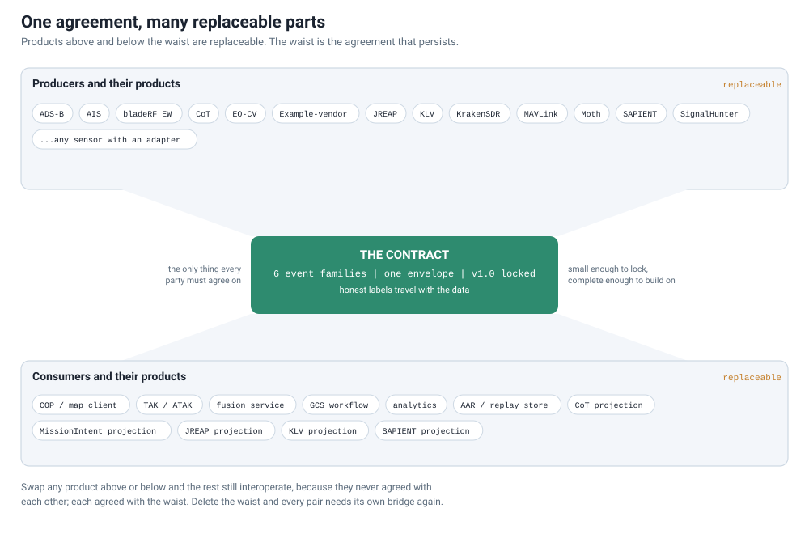

# ZMeta Specification (v1.0 Locked, current release v1.1.26)

ZMeta is a free, open, transport-agnostic semantic standard for resilient ISR.
It defines one honest event model that heterogeneous sensors, analytics,
gateways, TAK clients, and mission systems can share without silently changing
what the data means. A sensor is adapted to ZMeta once and then interoperates
with everything else ZMeta maps, which removes the need for N×N point-to-point
bridges.

**Open specification.** ZMeta is published under the Apache License 2.0 and has
been publicly available at this repository since 2026-01-17, with dated, signed
releases since 2026-01-18. The licenses are perpetual and irrevocable: no party
can obtain exclusive rights over the published specification, schemas, policy,
or reference code, and nobody can withdraw them. Anyone may implement, fork, or
build on them under the license. See `NOTICE`, `IP_POLICY.md`, `TRADEMARK.md`,
and `docs/zmeta_defensive_publication.md`.



### What ZMeta provides

- **Integration cost scales with the number of sources.** Ten sensors and five
  consumers require fifty point-to-point bridges, or fifteen adapters to a
  single contract. Writing an adapter against `adapters/AUTHORING.md` is a
  single-sitting task, and the repository ships worked references to copy.
- **Honesty is machine-checked.** Uncertainty, provenance, lineage, and timing
  quality travel with the data and are validated against policy. Degraded,
  stale, or externally promoted data cannot be made to look clean, so the
  consumer adjudicates truth rather than a black box.
- **Degraded links are a design case.** Three export profiles thin data for
  bandwidth without changing meaning, and a Profile L state event fits within
  a tactical packet budget. The size comparison below shows the encodings.
- **Each layer keeps its own authority.** A line of bearing is not a track,
  and a track is not sufficient basis for a command. Those distinctions are
  machine-checkable, which is what makes automated retasking auditable.
- **No lock-in to a vendor, a transport, or this project.** Apache-2.0
  licensing, a locked v1.0 kernel, and a governed change process. See
  `IP_POLICY.md`.

### The semantic pipeline

Each transition is a deliberate, evidence-bearing promotion: data moves to a
higher-authority lane only when lineage, timing, and confidence support it.


```mermaid
flowchart LR
  Obs["OBSERVATION_EVENT<br/>measured facts"]
  Inf["INFERENCE_EVENT<br/>AI / analytic claim"]
  Fus["FUSION_EVENT<br/>track identity"]
  St["STATE_EVENT<br/>operator-facing track"]
  Cmd["COMMAND_EVENT<br/>bounded mission intent"]
  Sys["SYSTEM_EVENT<br/>health, timing, link, TASK_ACK"]

  Obs -->|"derive (+ lineage)"| Inf
  Inf -->|"contribute to"| Fus
  Fus -->|"project"| St
  St -->|"justify"| Cmd
  Sys -.->|"status across every stage"| St
```

### Encoding size on a tactical link



The chart shows the same Profile L `STATE_EVENT` in four wire formats. All four
decode back to the same canonical JSON event, field for field and value for
value. Ordering is not semantic, so map order, wire field order, compact
integer keys, and protobuf field order may differ between them
(`spec/semantics-contract.md` section 3.5). Encoding does not create
authority: a compact packet is valid only if the decoded event passes the same
schema, policy, and conformance checks that a JSON event does.

[`docs/zmeta_professional_overview.md`](docs/zmeta_professional_overview.md)
covers the whole stack in one document: architecture, the six event families,
adapters, gateway deployment, risk adjudication, AI provenance, and worked
operational scenarios including RF detection through automated retasking,
multi-node geolocation, and GPS-denied operation. Start there if you are
evaluating ZMeta rather than building against it.

## ZMeta In The Field

The reference stack is extracted from fielded deployments. Four of the five
ingress adapters marked "Production" in `adapters/README.md` came from:

- a hosted EO/CV integration deployment: fixed-camera detections build a full
  local `OBSERVATION -> INFERENCE -> FUSION -> STATE` chain on the edge,
  publish only validated `STATE_EVENT`s to a hosted control plane, render on
  a live operator map, and project to TAK/ATAK as honest CoT through a
  governed egress path;
- mobile RF direction-finding deployments: KrakenSDR coherent DoA, Moth
  RF-over-MAVLink, and SignalHunter PSD-sweep sensors feeding RF
  `OBSERVATION_EVENT` lines of bearing into downstream fusion.

Deployment reports are the standard's primary evidence stream, covering what
mapped cleanly and what did not. The promotion evidence bar is defined in
`spec/extension-registry.md`. Open a deployment field report issue to
contribute one.

## What ZMeta Is
- A semantic contract
- A JSON schema
- A policy-driven enforcement model
- A reference gateway and adapters

## What ZMeta Is Not
- Not a transport
- Not a C2 system
- Not a video container
- Not a replacement for MISB

ZMeta is a layer, not an application. Anything built with it (a COP, an
adapter, a fusion service) is a product, and every product in a ZMeta
deployment is replaceable; ZMeta is the agreement they are built against.



For the full first-exposure walk-through of the standard, with every concept's
definition site and enforcement status, see
[`docs/zmeta_ontology_reference.md`](docs/zmeta_ontology_reference.md).

ZMeta does not replace CoT, MAVLink, JREAP, MISB, or vendor sensor formats. It
gives them a shared vocabulary for what was observed, what was inferred, what
was fused, what an operator should see, and what mission intent is being
requested.

## Design Goals
- Honesty under uncertainty
- Graceful degradation
- Operator trust
- Interoperability across vendors and transports

## See It Work In Ten Minutes

Prereq: Python 3.11+ (no Docker needed for this path).

> **Windows users:** enable long-path support once before cloning, with
> `git config --global core.longpaths true`. Without it, a clone into an
> already-deep directory can fail checkout with `Filename too long`, which is
> the Windows 260-character path limit. The symptom looks like a corrupt
> clone, but the cause is the path length.

```
python -m pip install -r requirements.txt

# terminal 1: reference gateway (schema + policy enforcement)
python tools/run_gateway.py --profile H
# The default is the locked v1.0 lane. v1.1.0 producers add
#   --schema-path schema/zmeta-event-1.1.0.schema.json
# and a mixed-lane deployment can select by zmeta_version with
#   --schema-path schema/zmeta-event.schema.json
# The gateway's own diagnostics are v1.0 events on every lane, so a consumer
# of a 1.1.0 lane selects each event's schema by zmeta_version
# (gateway/README.md, Schema lanes).

# terminal 2: watch validated output arrive
python tools/udp_receiver.py --host 127.0.0.1 --port 5556

# terminal 3: replay a real OBSERVATION -> INFERENCE -> FUSION -> STATE chain
python tools/replay.py --file examples/zmeta-examples-1.0.jsonl --host 127.0.0.1 --port 5555
```

Then validate events of your own against the locked contract:

```
python tools/validate.py --file <your-events>.jsonl --profile H --strict
```

### Prerequisites and the fuller walkthrough

The path above needs only Python 3.11+. For the Docker gateway, encodings, and
CoT emission, install the dev extras and follow the full walkthrough:

```
python -m pip install -r requirements-dev.txt
```

Windows Docker note: Docker Desktop requires virtualization + WSL2 enabled. If
Docker is not available, run the gateway directly with Python as shown above.

See `spec/quickstart.md` for the runnable gateway + UDP replay walkthrough, and
`docs/zmeta_two_node_quickstart.md` to deploy sensor-edge-to-COP across two
nodes.

## Start Here By Role

- **Building an adapter** (your sensor or format -> ZMeta): read
  `adapters/AUTHORING.md`, then copy the worked exercise in
  `adapters/ingress/example-vendor/` and the worked chains in
  `examples/zmeta-examples-1.0.jsonl` (RF) and
  `examples/zmeta-eo-chain-examples.jsonl` (EO).
- **Integrating or deploying**: `spec/installation-guide.md` for a
  step-by-step install, `spec/quickstart.md` for the developer walkthrough,
  and the Deployment Checklist below for drift-locked production setups.
- **Evaluating the standard**: start with
  [`docs/zmeta_professional_overview.md`](docs/zmeta_professional_overview.md),
  the single document that explains the whole stack with diagrams and worked
  scenarios, then `spec/semantics-contract.md` (normative),
  `spec/profile-compatibility.md`, and `CONFORMANCE.md`.
- **Looking a concept up**: [`docs/zmeta_ontology_reference.md`](docs/zmeta_ontology_reference.md),
  the status-marked map of every concept, what defines it, and what enforces
  it, with a register of known divergences between surfaces.
- **Building UIs or consumers**: `spec/field-dictionary.md`; encoding
  guidance in `spec/compact-binary-mapping.md` and
  `spec/protobuf-encoding.md`.
- **Contributing, agents, and maintainers**: `AGENTS.md` and
  `docs/zmeta_change_governance.md` before changing governed artifacts;
  `CONTRIBUTING.md` for contribution terms.
- **Industry reviewers**: `IP_POLICY.md`, `CONFORMANCE.md`, `TRADEMARK.md`,
  and `docs/zmeta_defensive_publication.md` before relying on compatibility,
  contribution, or public-sharing claims.
- **Downstream clone users**: read the downstream clone limits in `AGENTS.md`
  and `docs/zmeta_change_governance.md` before altering schema, semantics,
  policy authority, or event vocabulary.

## Current Release

- Current release: `v1.1.26`
- Release notes and assets: <https://github.com/JTC-byte/zmeta-spec/releases/tag/v1.1.26>
- Release focus: the reference CoT egress adapter's `cds` profile, the shape
  one partner's cross-domain guard passed into a higher enclave on
  2026-09-29, selectable by name; with it, three changes a downstream
  ecosystem's research pass asked for (a track's class becomes its CoT type
  only when it parses as one; the gateway's diagnostic identity is a
  setting; the gateway's outgoing self-check keeps its own diagnostics
  legible on the 1.1.0 lane) and the integration line's held content: two
  experimental 1.1.0 acoustic markers and a linear-pressure level form
  minted from a live hydrophone, the validation guidance system with the
  F1 field-evidence adjudications, the ontology reference, the branching
  rule and the open-specification notice set. The locked v1.0 schema and
  the semantic contract file are byte-identical to v1.1.25 and the policy
  pack is unchanged. Governed artifacts changed in this release, relative
  to zmeta-v1.1.25: schema/zmeta-event-1.1.0.schema.json,
  spec/extension-registry.yaml. The registry's Markdown, the field
  dictionary, the future-branch roadmap and the advisory schema README
  changed with them.
- Normative contract: v1.0 locked semantic contract, canonical version-discriminated
  JSON schema, v1.0 JSON schema, and policy pack.
- Experimental extension: `schema/zmeta-event-1.1.0.schema.json` is provided for proposed
  compatibility testing only; v1.1.0-only fields are not part of the locked v1.0 contract.

## v1.1.26 Integration Notes

- **The v1.0 wire does not change.** The locked v1.0 schema and the
  semantic contract file are byte-identical to v1.1.25, the policy pack is
  unchanged, and no existing event that validated before fails now.
- **A CoT egress profile for a cross-domain guard.** `cot_config["profile"]`
  is `standard` by default, the adapter's own output unchanged; `cds` is the
  shape one partner's guard passed on 2026-09-29 (n=1): four detail
  children, `how` asserted by the deployment, one remarks line with no
  links, a stale ceiling. The gateway refuses to start on a `cds` config
  without a `how` token. The adapter README's "Profiles" section states
  what is and is not claimed.
- **A label in `payload.class` no longer becomes a CoT type.** The CoT
  egress uses the class as the type only when it parses as a CoT atom
  type; any other class goes out as `a-u-G` with the label quoted in
  `remarks`. A producer that stored a label there reaches TAK differently
  than before, and honestly.
- **Consumers on the 1.1.0 lane see legible diagnostics.** The gateway's
  own diagnostics are v1.0 events on every lane, and its self-check now
  validates them against the schema their declared version selects, so a
  1.1.0-lane consumer receives 1.1.0 producer events beside v1.0
  diagnostics and selects each event's schema by `zmeta_version`, as the
  dispatching schema does. Before this release every such diagnostic
  reached the wire content-free.
- **The gateway's identity is a setting.** `gateway_producer` and
  `gateway_node_role` default to the historical values; a configured
  identity is checked against the loaded policy at startup.
- **The 1.1.0 acoustic lane grows, experimentally.** `features.level_reference`,
  `timing_quality.est_error_basis` and the `pressure_pa` /
  `pressure_statistic` level form are experimental 1.1.0 vocabulary with
  the promotion bar stated as not met; the locked v1.0 lane rejects the new
  keys by its own closure.
- **This release ships signed.** Detached signatures accompany the release
  assets, made with the Incept.IO ZMeta release signing key
  (`A3B150AF2A0E1CA413C4B7F112BE81F54654B96E`). Verify against
  `SHA256SUMS_v1.1.26.txt` and its signature.

## Repository Structure
- `spec/` Core specification and normative text.
- `schema/` JSON schema definitions for ZMeta artifacts.
- `examples/` Sample payloads and usage patterns.
- `conformance/` Must-pass/must-fail regression corpus.
- `policy/` Policy language and enforcement guidance.
- `export/` Derived, non-authoritative projections of governed artifacts.
  Currently `export/policy/*.json`, a verbatim JSON rendering of
  `policy/*.yaml` for consumers that cannot read YAML. Generated and
  hash-pinned; never edited by hand. See `export/README.md`.
- `gateway/` Reference gateway implementation and tests.
- `adapters/` Ingress and egress adapter patterns and templates.
- `tools/` Utilities for validation and development workflows.
- `docs/` Advisory guidance plus maintainer process records. See
  `docs/README.md` for which is which.
- `AGENTS.md`, `docs/zmeta_change_governance.md` Human and AI agent change
  governance, process limits, documentation requirements, and release workflow.

## Adapters

Reference adapters show how to translate between ZMeta and external systems.
See `adapters/README.md` for ingress templates, mapping packs, and egress
projections, and `adapters/AUTHORING.md` for the step-by-step authoring guide.

Adapter semantic mapping:
- Native sensor measurements map to `OBSERVATION_EVENT`.
- Classifier or detector output maps to `INFERENCE_EVENT`.
- Track association and identity creation map to `FUSION_EVENT`.
- Operator display projection maps to `STATE_EVENT`.
- Mission tasking maps to `COMMAND_EVENT` only through deconfliction.
- Health, timing, link, validation, and task acknowledgement reports map to `SYSTEM_EVENT`.

**If TAK shows nothing for your live feed**, the cause is almost always
one of two documented facts, not a broken adapter: CoT egress projects
`STATE_EVENT` only (raw observations never render), and the track
projector only promotes observations whose subject broadcasts an
identity, so anonymous detections have no track path today. The
projector counts what it declines (`refused_no_identity`). The decision
table, the failure signature, and the honest workarounds are in
`adapters/AUTHORING.md` ("From A Green Ladder To A Display").

ZMeta is strict about semantic invariants and flexible through ignorable,
namespaced, non-semantic extensions. Extensions must not redefine core event
meaning, authority boundaries, units, lineage, profile behavior, or command
safety.

## Schemas and Examples

Use `schema/zmeta-event.schema.json` as the canonical validation entry point.
It dispatches by `zmeta_version` and prevents v1.1.0 vocabulary from validating
under a v1.0 event. Version-specific wrappers are retained for integrations that
need a fixed target:
- `schema/zmeta-event-1.0.schema.json`
- `schema/zmeta-event-1.1.0.schema.json`

Runnable examples live in `examples/`:
- `zmeta-examples-1.0.jsonl`: RF observation, inference, fusion, and state projection.
- `zmeta-eo-chain-examples.jsonl`: worked EO full chain with genuine chained lineage.
- `zmeta-profile-H-examples.jsonl` and `zmeta-profile-M-examples.jsonl`:
  Profile H and Profile M example sets.
- `zmeta-profile-L-examples.jsonl`: Profile L state/system/command examples.
- `zmeta-command-examples.jsonl`: GOTO and TASK_ACK lifecycle.
- `zmeta-correlation-pattern-examples.jsonl`: companion events for
  `docs/zmeta_correlation_pattern.md`.
- `encoding-roundtrip.jsonl`: golden corpus for CBOR/compact/protobuf
  round-trip tests.
- `zmeta-v1.1-examples.jsonl`: SENSOR_STATUS, PLATFORM_STATUS, data_ref/data_refs,
  error_ellipse_m, and v1.1.0 tasking examples.

Intentionally invalid examples live in `conformance/must-fail.jsonl`; valid
regression fixtures live in `conformance/must-pass.jsonl`.

## Tools

Quick helpers for local validation and UDP replay:

```
python tools/run_gateway.py --profile H
python tools/udp_receiver.py
python tools/udp_sender.py --file examples/zmeta-command-examples.jsonl
python tools/replay.py --file examples/zmeta-command-examples.jsonl --delay-ms 200
python tools/check_compat.py legacy-events.jsonl --target v1.1.26
python tools/validate.py --file examples/zmeta-command-examples.jsonl --profile L
python tools/check_adapter.py --events my-adapter-output.jsonl --fixtures my-fixtures.jsonl
python tools/validate_conformance.py --strict
python tools/validate_release_manifest.py --manifest release/zmeta-release-manifest.yaml
python tools/validate_release_package.py --manifest release/zmeta-release-manifest.yaml --templates-only
python tools/compute_contract_hash.py
python tools/export_policy_json.py --check
python tools/test_gateway_live.py
python tools/test_workflow_end_to_end.py
```

End-to-end workflow variants:
```
python tools/test_workflow_end_to_end.py --profile M
python tools/test_workflow_end_to_end.py --profile L
python tools/test_workflow_end_to_end.py --profile M --expect COMMAND_EVENT,SYSTEM_EVENT
```

`tools/test_gateway_live.py` exercises live UDP forwarding, COMMAND dedupe, and CoT emission.

Makefile targets run the same commands with `python` directly; ensure dependencies are installed
(`python -m pip install -r gateway/requirements.txt -r requirements-dev.txt`).

## Versioning
- v1.0.x = clarifications and fixes
- v1.1+ = proposed backward-compatible extensions until explicitly locked
- v2.0 = breaking changes

See `spec/versioning.md` for the full policy.

## Installation and Packaging

See `spec/installation-guide.md` for a deterministic install guide, gateway wizard,
and mapping pack installs for drone and sensor configs.

Timing quality metadata (`time_source`, `sync_state`, `est_error_ms`,
`last_sync_ts`) is required by the semantic contract for operational events.
Gateway `event.t_receive` / `event.t_publish` stamps are separate latency and
AAR fields added by the reference gateway when configured.
Adapter fallback timing (`UNKNOWN` / `UNSYNCED`) is intentionally degraded and
should be replaced by source-provided GPS/NTP/PTP timing or periodic
`TIME_STATUS` as soon as a deployment can expose it.

Deployment helpers:
- Config templates: `configs/edge-config.json`, `configs/gateway-config.json`
- Docker Compose: `deploy/edge/docker-compose.yml`, `deploy/gateway/docker-compose.yml`
- Bundle builders:
    - `python release/build_mvp_packages.py --version v1.1.26` produces `zmeta-edge-v1.1.26.zip` and `zmeta-gateway-v1.1.26.zip`
    - `python release/build_release_bundle.py --version 1.1.26` produces `zmeta-v1.1.26-dist.zip`
    - `python tools/build_release_package.py --manifest release/zmeta-release-manifest.yaml --output-dir release/package-v1.1.26 --release-id zmeta-v1.1.26 --release-state formal_release --no-signatures --release-notes release/RELEASE_NOTES_v1.1.26.md` builds formal package metadata without creating signatures. `--release-notes` is mandatory for `formal_release`: omit it and the unpopulated notes template is copied verbatim, which `tools/validate_release_package.py` refuses with `RELEASE_PACKAGE_NOTES_PLACEHOLDER`.
    - `python release/sign_release_artifacts.py --version v1.1.26 --write-checksums --sign --target all` signs release assets with detached PGP signatures when an approved signing key is available.

## Deployment Checklist (Compact)

Use this to lock down schema, policy, and semantic-contract drift and verify a clean deployment:

1. Compute schema, policy, semantic-contract, and combined contract hashes: `python tools/compute_contract_hash.py`
1. Set `require_contract_hash` (and optionally `require_schema_hash`/`require_policy_hash`) in config.
1. If adopting a policy variant into the active `policy/` directory, recompute and update the deployment hash gates.
1. Validate the governed release baseline: `python tools/validate_release_manifest.py --manifest release/zmeta-release-manifest.yaml`
1. Validate formal release package templates or generated package output before distribution.
1. Run self-test: `python tools/run_gateway.py --profile H --self-test`
1. Run conformance: `python tools/validate_conformance.py --kernel-gate`
1. Verify consumer risk posture where needed: `python tools/filter_risk.py --input gateway-output.jsonl --preset command --fail-on-drop`
1. Start gateway with strict mode (optional): `python tools/run_gateway.py --config configs/gateway-config.json --strict-validation`
1. Verify metrics and drops in logs (enable `metrics_log_path` if needed).

Before publishing changes to the repository itself, follow
`docs/zmeta_change_governance.md`; release publication additionally requires
`RELEASE_CHECKLIST.md`.

## Normative vs Reference

Normative (contract): `spec/semantics-contract.md`, `schema/zmeta-event.schema.json`, `schema/zmeta-event-1.0.schema.json`, `policy/*.yaml`, `spec/versioning.md`
Reference: `gateway/*`, `tools/*`, `adapters/*`, `examples/*`

Normative files define compliance. Reference components exist to accelerate adoption.

## Industry Sharing And IP Posture

ZMeta is published under Apache License 2.0 as an open specification and
reference stack. For broad industry conversations, cite the public repository,
a tagged release, release notes, release manifest hashes, conformance evidence,
and `docs/zmeta_defensive_publication.md`. Avoid privately disclosing
unpublished roadmap concepts, future vocabulary, or deployment-specific
mappings before they are public or covered by an appropriate agreement.

`IP_POLICY.md`, `CONTRIBUTING.md`, `CONFORMANCE.md`, and `TRADEMARK.md` define
the project's advisory posture for contributor authority, private dialects,
conformance claims, and use of the ZMeta name. These documents are project
governance, not legal advice or a formal standards-body patent policy.
