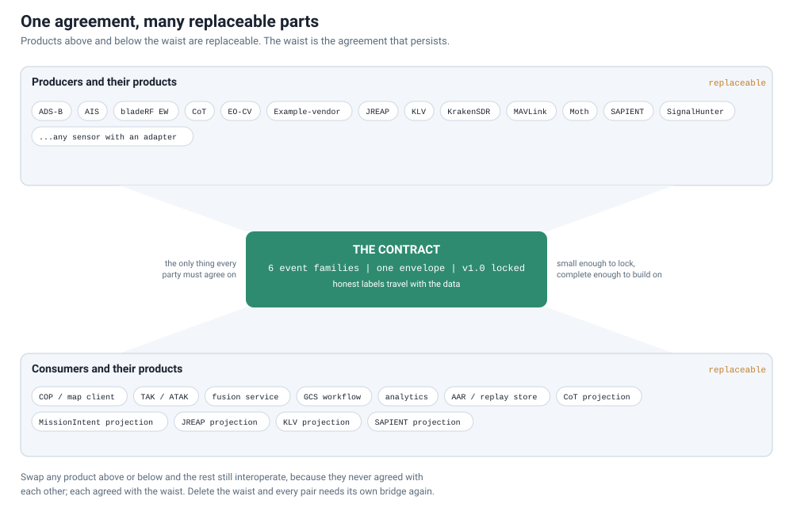
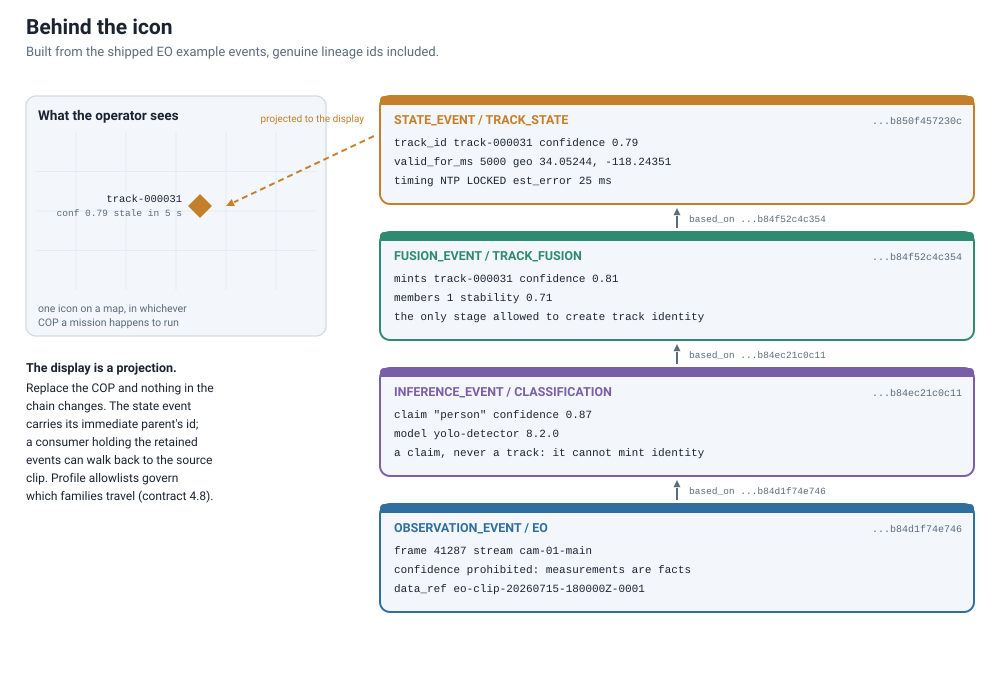
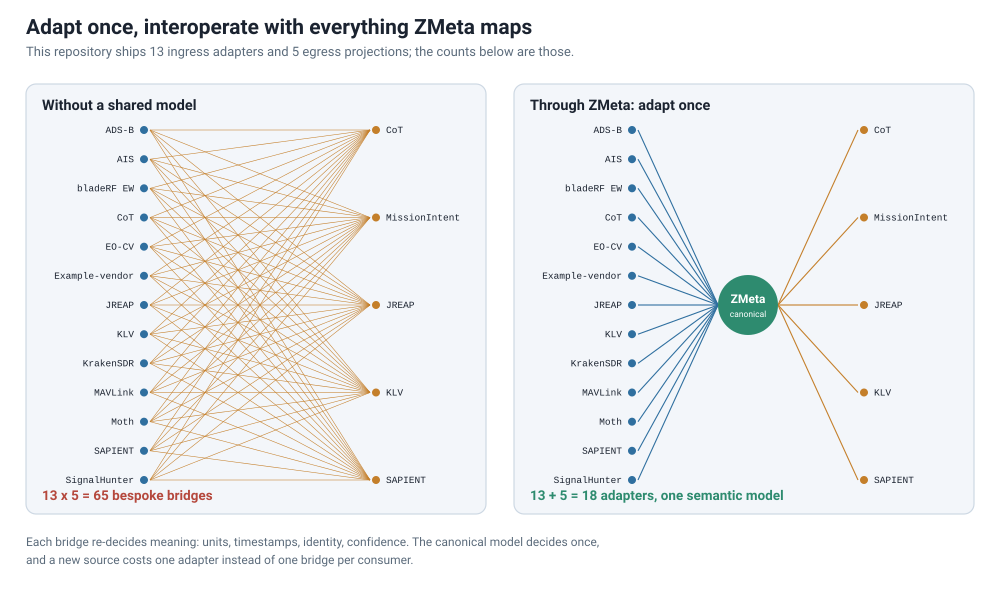
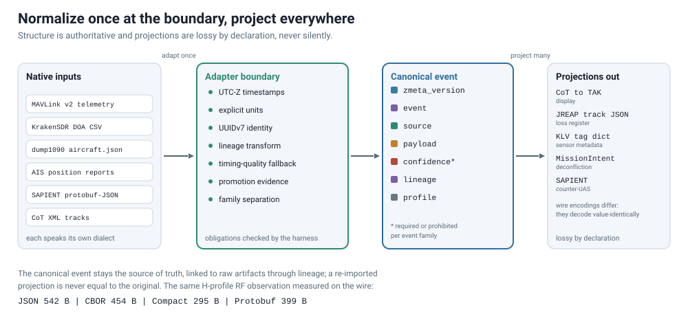
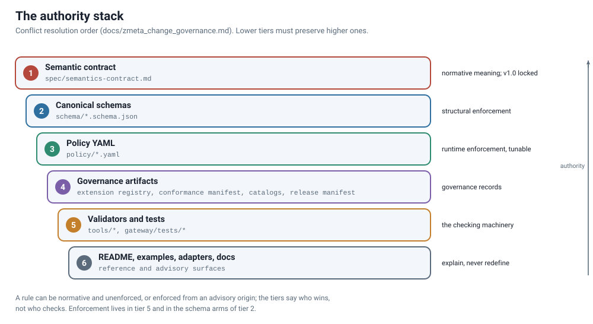
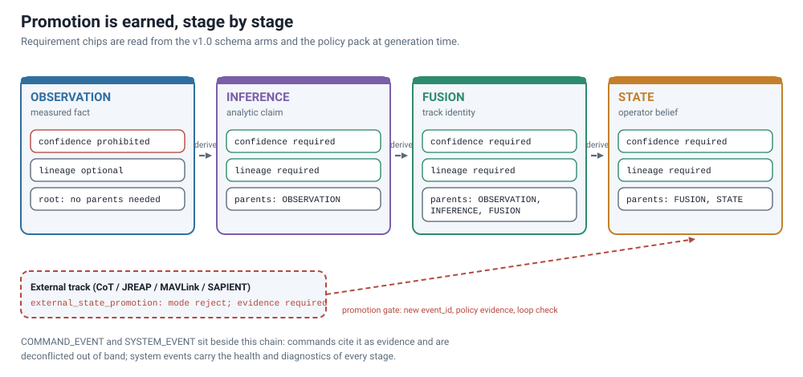
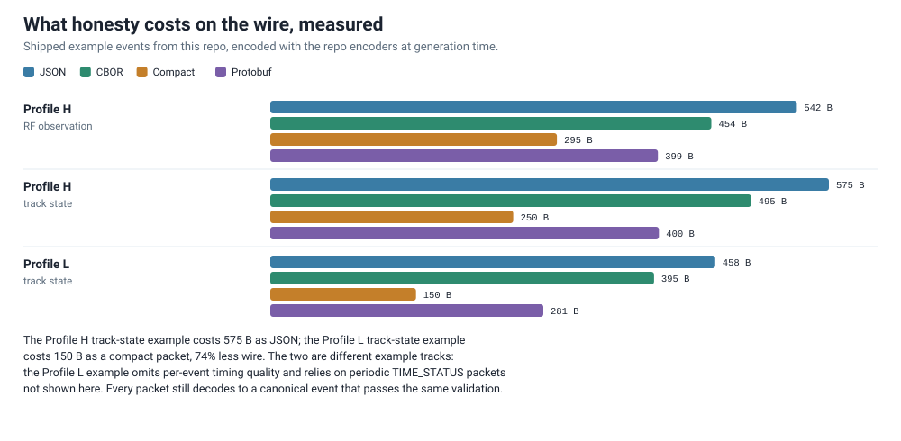
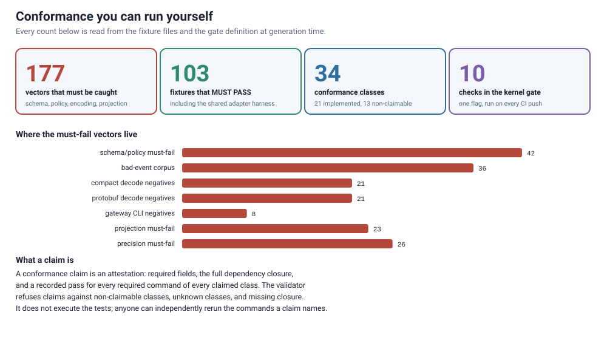
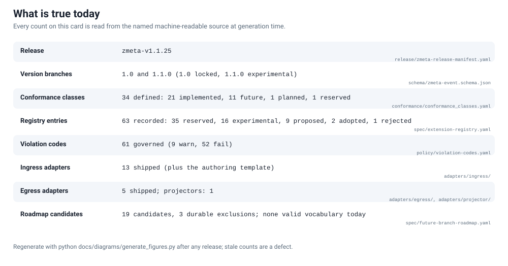

# ZMeta Ontology Reference

Status: advisory reference (Docs/advisory change class), non-normative.
Facts verified against the repository at release v1.1.25.

This document explains what ZMeta is, then maps every concept in the
standard (its concept model, rule classes, policy surfaces, conformance
system, version branches, and adapter estate), each showing where it is
defined and whether machinery actually checks it. It is not the normative
contract. When anything here conflicts with a governed source, the
authority stack in `docs/zmeta_change_governance.md` wins, starting with
`spec/semantics-contract.md`, the canonical schemas under `schema/`, and the
policy pack under `policy/`. This page cites doctrine; it does not restate
it.

## 0. Seeing The Layer

ZMeta is a layer, not an application. Everything you can point at in a
running deployment (a COP with live tracks, the adapters feeding it, the
fusion service behind it) is a product built on ZMeta, and every one of
those products is replaceable. ZMeta is the agreement they are built
against: a free, open semantic alphabet for ISR data, made of a locked set
of composable event primitives, the honesty labels that travel with them,
and the machinery an integrator can run to check that an implementation
speaks the language. It stands to those products the way Unicode stands to
a word processor: the standard underneath, shared by everything built on
it.

Its peers are interface standards and semantic contracts. The bet behind
it is a ladder: innovation needs modernization, modernization needs
automation, and automation needs standardization. ZMeta is the standardize
rung, kept small and honest so the rungs above it can exist.

*Figure: the thin waist, with producer and projection counts read from the
adapter estate and the family count read from the locked schema at
generation time. Products do not have to agree with each other; each agrees
with the contract at the waist, which is why swapping one leaves the rest
working.*

*Figure: one icon, decomposed into the repository's own EO example events
with their genuine lineage ids. The display renders the top of the chain,
and the state event carries the identifier of its immediate parent, so a
consumer holding the retained events can walk the chain back to the source
clip, whichever COP the mission runs.*

Every number in the two figures below is measured from this repository at
generation time: the adapter estate is counted from the directories, and
the wire sizes are encoded with the repo's own codecs.

*Figure: the integration arithmetic, counted from the adapter estate.
Every bespoke bridge re-decides units, timestamps, identity, and
confidence on its own; the canonical model decides once, and a new source
costs one adapter instead of one bridge per consumer.*

*Figure: normalize once at the boundary, project everywhere. The external
projections are lossy by declaration and one-directional in authority,
while wire encodings are a separate control plane and decode
value-identically.*

## 1. How To Read This Page

The rest of this document is a reference. Every claim in it was checked
against the primary source it names, and every enumeration was recounted
from the machine-readable artifact rather than copied from a prose table;
Section 14 records the places where two surfaces disagree, and Section 15
describes the method. Each concept carries exactly one status mark:

- **NORMATIVE**: a binding rule stated in a normative spec surface (the
  semantic contract, or the canonical schemas read as contract text). Where
  the source assigns a rule class (`LOCKED`, `TUNABLE`), the mark says so.
- **ENFORCED**: mechanically checked by machinery that actually runs: a
  schema arm, a policy file a validator reads, a validator script, a fixture
  suite, or a CI gate. The enforcing artifact is named. A rule that is both
  normative and enforced is marked ENFORCED, with the normative source
  cited.
- **ADVISORY**: real but non-binding. Pattern guides, READMEs, playbooks,
  process guidance, and anything that disclaims normative force in its own
  text.
- **FUTURE**: named but not valid vocabulary today. The entry says what
  would make it valid.
- **DIVERGENT**: two surfaces disagree. These live in Section 14.

The distinction matters in both directions. A rule can be normative and
unenforced: the contract says only fusion nodes may create `track_id`, and
no machinery checks it (Section 6). A check can be enforced with no
normative sentence of its own: the command-evidence gate is policy-layer
machinery operating under the contract's general delegation to policy
(Section 6). Written down, normative, and mechanically enforced are three
different properties, and this page tracks them separately.

*Figure: the conflict-resolution order from `docs/zmeta_change_governance.md`
("Authority Stack"). Lower tiers must preserve higher ones. Enforcement
machinery lives at tier 5 and in the schema arms of tier 2; authority does
not.*

## 2. The Document Estate

The repository's documents fall into four standings. A census of every
tracked markdown file at the root and under `docs/` supports the split.

**Normative surfaces.** `spec/semantics-contract.md` (v1.0 Locked) is the
single semantic authority: its own authority statement reads "The semantic
contract is authoritative. Schemas, policy packs, encodings, adapters,
gateways, examples, and conformance tests are implementation surfaces that
must preserve this contract" (contract, Purpose And Authority). The
canonical schemas in `schema/` and the policy YAML in `policy/` are the
machine-readable halves of that authority, ranked immediately below the
contract in the authority stack; the README's own normative list names the
dispatcher and the v1.0 branch schema alongside `policy/*.yaml`.

**Governed process documents.** `AGENTS.md`, `docs/zmeta_change_governance.md`,
`docs/zmeta_defensive_publication.md`, `CONFORMANCE.md`, `CONTRIBUTING.md`,
`IP_POLICY.md`, and `TRADEMARK.md` are hash-pinned in the release manifest,
so any edit forces a manifest rebuild (Section 11 covers the machinery
family). The four
governance siblings self-label "current-main advisory governance";
the change-governance document self-labels "current-main process baseline"
and carries the authority stack. `AGENTS.md` states no standing of its own
and appears in no rung of the authority stack it operates under; Section 14
records this.

**Advisory guidance.** The pattern guides, quickstart, crosswalks, MQTT
binding guidance, audit playbook, and this page all self-declare advisory
and non-normative status in their own headers. Six advisory documents (the
professional overview, the two pattern guides, the vocabulary crosswalk,
the MQTT guidance, and the live-test checklist) carry a release context
header that a test pins against the release manifest, so their version
claims cannot silently go stale. The quickstart, the audit playbook, and
this page carry no such header.

**Process records.** The dated `s1_*` / `r1_*` files, the panel registers,
the worklog and handoff, the doctrine review log, the after-action log, and
the errata files are maintainer working artifacts. `docs/README.md` freezes
the audit-record family as of 2026-08-13: they take dated correction notes
and are never rewritten, renamed, or moved. The freeze has mechanical
teeth: conformance-class evidence entries reference these files by path,
and the class validator fails if a referenced record disappears
(Section 11). Path stability is checked; the never-rewritten clause is
convention.

## 3. Rule Classes

The contract sorts every rule into four classes (contract §3.3, NORMATIVE):

- **LOCKED** rules protect interoperability and semantic truth and must not
  be loosened by deployment policy. Named examples: exact version selection,
  event type and subtype meaning, field units, layer separation, event
  identity, required lineage presence for derived events, command safety,
  and profile projection monotonicity.
- **TUNABLE** rules control operational response within the contract and may
  vary by deployment, profile, producer, route, event type, consumer, or
  temporary operator override. Named examples: timing freshness thresholds,
  unresolved-lineage tolerance, external promotion response, confidence and
  TTL caps, profile thinning, producer allowlists, routing gates.
- **ADVISORY** rules are recommendations, not structural validity, unless
  promoted.
- **FUTURE_EXTENSION** rules reserve or propose concepts that are not valid
  current vocabulary and must remain non-claimable until an approved version
  branch adopts them.

Tunable responses use a bounded action vocabulary: `reject`, `warn`,
`degrade`, `quarantine`, and `ignore`, with `ignore` permitted only for
explicitly non-material checks (contract §3.3). The reference policy pack
uses `ignore` exactly once, for Profile L unresolved lineage parents, and a
lint (`tools/lint_policy_risk_modes.py`) flags any other `ignore` on a
material risk dimension (ENFORCED).

## 4. The Envelope

**Version dispatch (ENFORCED).** `schema/zmeta-event.schema.json` is a
two-arm `oneOf` dispatcher: `zmeta_version: "1.0"` validates only against
the locked v1.0 schema, `"1.1.0"` only against the experimental branch.
Both branches pin the version with a JSON Schema `const`, so no other value
validates anywhere. The reference gateway's default configuration loads the
v1.0-only schema directly, so a default-configured gateway rejects every
v1.1.0 event. That default is a deployment fact worth knowing, not a
defect; Section 12 covers the branch model itself. The conformance and
example validators load the dispatcher; several single-purpose tools (the
contract hash, the registry validator, the vocabulary lint) load the v1.0
branch schema directly by design.

**Required shape (ENFORCED).** The envelope requires exactly four top-level
properties: `zmeta_version`, `event`, `source`, `payload`. `profile`,
`confidence`, and `lineage` are optional at the envelope level and become
required or prohibited per event type (Section 5). The optional `profile`
key names one of three export tiers: L for the most constrained links, M
for moderate backhaul, H for full fidelity; Section 8 carries their
allowlists and projection rules. The top level, `event`,
`source`, and `geo` objects all set `additionalProperties: false`.
`CommandPayload` is the only payload type that closes `additionalProperties`;
every other payload type stays open for extension space.

**Identity (ENFORCED, contract §4.3 LOCKED).** `event.event_id` must be a
UUIDv7 per RFC 9562, enforced by a regex arm that pins the version and
variant nibbles, and exercised by negative fixtures (a decoded UUIDv4
identity must fail). Adapters ingesting legacy identifiers must regenerate
`event_id` as UUIDv7 at the boundary and may preserve the legacy id as
payload-scoped provenance. Nothing may be encoded into the id, and
consumers must not infer timing or ordering from its timestamp bits while
`event.ts` and timing quality are available. `zmeta_uuid.py` is the
reference minting implementation.

**Source identity (ENFORCED).** `source` requires `platform_id`,
`node_role`, and `producer`; `sensor_id` and `sw_version` are optional and
nullable. `node_role` is a closed five-value enum: `EDGE`, `GATEWAY`,
`APEX`, `DMZ`, `CLOUD`, identical in the contract, both schemas, and
`policy/roles.yaml`. Producer names are deliberately open strings: producer
authority is deployment policy, not schema (contract §4.5).

**Timestamps (ENFORCED).** All timestamps validate against a `utcDateTime`
definition requiring RFC 3339 `date-time` format with a trailing `Z`. The
v1.0 pattern is deliberately permissive (`Z$` only) because narrowing it
would move the v1.0 lock hash; the v1.1.0 branch adds a structural
calendar-shape pattern, and the gateway closes the remaining gap at runtime
with a plausibility check (Section 7).

**Append-only immutability (NORMATIVE, contract §4.2 LOCKED; partially
ENFORCED).** Events are never modified or deleted; corrections are new
events with new ids and lineage. No intermediary may change `event.ts`,
`event.event_id`, `event.event_type`, `event.event_subtype`, `source`,
`payload.track_id`, `lineage`, or payload meaning. The enforced projection
side of this rule is `policy/profile-precision.yaml`'s 17-path
`immutable_paths` list checked by `tools/validate_precision_policy.py`
(`PRECISION_POLICY_IMMUTABLE_CHANGED`), plus `tools/validate_projection.py`,
which separately refuses a projection that rewrites the optional
`source.sensor_id` or `source.sw_version` instead of omitting them
(`PROJECTION_SOURCE_REWRITTEN`). The enforced list freezes more than the
prose names: the four payload discriminators and the v1.1.0 geo honesty
fields ride under the contract's "payload meaning" catch-all.

**Same-event projection (NORMATIVE, contract §4.2 LOCKED).** A profile
export may remain the same event (same `event_id`) only when it adds
non-semantic export metadata, adds gateway receipt or publish stamps, omits
optional fields, reduces precision, or conservatively lowers `confidence` or
`valid_for_ms`. Any increase in confidence, TTL, precision, or specificity
requires a new event with new identity and lineage.

**Deduplication (NORMATIVE, contract §13.2).** Events dedupe by `event_id`
except where a type has an explicit idempotency key: `COMMAND_EVENT` dedupes
by `payload.task_id` (duplicates must not be forwarded for execution twice;
the reference gateway enforces this with a TTL cache and emits a
`DUPLICATE_IGNORED` acknowledgement), and `TASK_ACK` dedupes by task id,
original event id, and state.

## 5. Event Families And Layer Discipline

**Six event types (ENFORCED, contract §7.2 LOCKED).** v1.0 defines exactly
`OBSERVATION_EVENT`, `INFERENCE_EVENT`, `FUSION_EVENT`, `STATE_EVENT`,
`COMMAND_EVENT`, `SYSTEM_EVENT`, as a closed schema enum. No additional
top-level types are permitted in v1.0, and no additional `system_type`
values are permitted either (contract §7.9).

**Six semantic layers (NORMATIVE, contract §4.4 LOCKED).** Each type owns
one layer: fact, opinion, belief continuity, operator state, bounded
directive, health and audit. No layer may collapse into another: raw
measurements must not masquerade as state, model claims must not create
track identity, state projections must not carry raw sensor features, and
command events must not bypass deconfliction.

**Subtypes are discriminators (ENFORCED, contract §7.3 LOCKED).**
`event_subtype` must come from the namespace of its event type and must
equal the payload's own discriminator field. The v1.0 vocabulary is 19
valid pairs:

| event_type | v1.0 subtypes | payload match |
| --- | --- | --- |
| OBSERVATION_EVENT | RF, EO, IR, ACOUSTIC, NETWORK | `payload.modality` |
| INFERENCE_EVENT | CLASSIFICATION, ASSOCIATION, ANOMALY, BEHAVIOR | `payload.inference_type` |
| FUSION_EVENT | TRACK_FUSION | fixed |
| STATE_EVENT | TRACK_STATE | fixed |
| COMMAND_EVENT | GOTO, ORBIT, HOLD, SEARCH_BOX | `payload.task_type` |
| SYSTEM_EVENT | LINK_STATUS, TIME_STATUS, SCHEMA_VIOLATION, TASK_ACK | `payload.system_type` |

The v1.1.0 branch adds six command task types (`RETURN_TO_BASE`, `LAND`,
`LOITER`, `SCAN_RF`, `TRACK_TARGET`, `CHANGE_SENSOR_MODE`) and two system
types (`SENSOR_STATUS`, `PLATFORM_STATUS`), all version-selected and
invalid under v1.0.

**Layer denylists (ENFORCED, dual-layer).** The layer rules are checked in
the schema and again in policy, so a flat violation fails schema validation
and a nested one fails the recursive policy walk:

- Observation payloads must not carry `track_id`, `entity_class`,
  `classification`, `label`, `class_name`, or `confidence`.
- Inference payloads and `payload.claim` must not carry `track_id`,
  `members`, or `estimated_state`.
- State payloads must not carry `features`, `raw_features`, `modality`,
  `measurement`, `measurements`, `t_start`, `t_end`, `data_ref`, or
  `data_refs`; the same nine names are schema-false at the payload top level
  and inside `extensions`.
- Command payloads must not carry altitude under any of eight contract-named
  keys; the schema prohibits them at the payload top level, inside
  `geometry`, and inside `extensions`, `target_geo` is structurally 2-D, and
  the policy denylist adds bare `alt` as a ninth defensive name. One
  residual is documented rather than hidden: altitude re-keyed under an
  arbitrary name such as `z_m` passes the name denylist
  (release notes v1.1.10, "Known Enforcement Limitation").

## 6. Promotion And Authority

*Figure: the promotion chain with requirements read from the v1.0 schema
arms and the policy pack at generation time. See
`docs/diagrams/generate_figures.py`.*

**The pipeline (NORMATIVE, contract §1; its locked force lives in layer
separation §4.4 and mandatory lineage §4.8).** The pipeline runs
observation, then inference, then fusion, then state. Each promotion is
earned: lineage and
confidence are schema-required for all three derived types (ENFORCED), and
the reference lineage policy constrains parent types per child (INFERENCE
from OBSERVATION; FUSION from OBSERVATION, INFERENCE, or FUSION; STATE from
FUSION or STATE). The parent-type and parent-resolvability checks run only
when the gateway has a local event store; without one they are inert by
design, matching the contract's delegation ("when an event store is
available", contract §3.2).

**Who may emit what (ENFORCED, three ANDed gates).** The reference gateway
runs role, producer-authority, and routing checks independently, and an
event must pass all of them:

- `policy/roles.yaml` gates by `node_role`: EDGE emits observations and
  system events only; GATEWAY may emit all six types; APEX emits fusion,
  state, system; DMZ and CLOUD emit state and system. Two deny rules bar
  COMMAND_EVENT from EDGE and from the producer `torch`.
- `policy/producer-authority.yaml` is the universal identity gate: 41
  glob-matched producer rules, with matching required for all six event
  types. Sensor families get observation and system only; classifier and
  detector families get inference and system; fusion families get fusion,
  state, and system; command emission is limited to three named rules (the
  deconfliction family, the retasking engine, and the legacy multi-role
  `sensorops` entry), the contract's command-authorized or
  deconfliction-authorized boundary. There is deliberately no wildcard
  state-projector rule,
  because an unnamed producer able to emit authoritative state would be an
  injection path (recorded in the file, 2026-08-02).
- `policy/routing.yaml` fails closed only for COMMAND_EVENT, flattening
  `required_origin`, `must_pass_through`, and `allowed_producers` into one
  origin allowlist, a documented v1.0 limitation since events carry no route
  metadata.

**Track identity (NORMATIVE, unenforced).** The contract states three
times that only fusion-authorized producers may create `track_id`, that
track ids must be globally unique, and that they are never reused after
loss, merge, split, or retirement. No machinery checks track-id minting:
the schema types `track_id` as a plain non-empty string, the producer gates
control who may emit FUSION_EVENT but STATE_EVENT is grantable to
non-fusion producers, and the contract itself lists global track-id
uniqueness among the things JSON Schema cannot enforce (contract §3.1).
This is the clearest example in the stack of a locked rule defended by
authority discipline rather than a gate.

**External promotion (ENFORCED, contract §4.5.1 LOCKED core).** A lossy
external track (CoT, JREAP, MAVLink, vendor COP, SAPIENT) must not become
authoritative `STATE_EVENT` without explicit promotion evidence. Promotion
creates a new event with a new `event_id`. The reference policy rejects
invalid promotion by default, requires an approved promotion policy id per
ingress family, scales the required evidence fields by profile (five at L,
eight at M, ten at H), always rejects loop and reflection risk, and labels
soft acceptances with allowed and prohibited uses. Six named producer
entries carry the gate; `sapient-ingress` is the only external ingress also
allowed to emit observations and inferences, and those lanes carry no
promotion requirement because the gate is state-scoped.

**Command evidence (ENFORCED policy elaboration).** A `COMMAND_EVENT` may
cite the inference, fusion, or state evidence that motivated it through
ordinary `lineage.based_on`. The gateway resolves citations against a
bounded index (4096 entries, oldest evicted, an evicted parent resolves as
unresolved rather than silently), rejects citations of parents whose risk
labels prohibit command use, and treats a parent whose risk labels cannot
be parsed as prohibited. A bare command with no citations stays legal
unless a deployment turns `require_evidence` on. The contract never names
this mechanism; it operates under the contract's delegation of lineage
consistency and use-label enforcement to policy (contract §3.2, §3.3), and
the file records one accepted tradeoff: under the default warn mode, an
attacker who can push more than 4096 distinct events can evict a
prohibited parent and downgrade its citation from reject to warn.

**Command lifecycle (ENFORCED).** Commands are TTL-bound (`valid_for_ms`
required, minimum 1), idempotent by task id, must declare
`requires_deconfliction: true` (schema `const`), and execute out of band.
`TASK_ACK` provides the auditable lifecycle: nine states, with a reason
code from a twelve-code enum required for the five negative states.

## 7. Time, Confidence, And TTL

**Three timestamps, three meanings (NORMATIVE, contract §5.1 and §5.2
LOCKED).** `event.ts` is observation, capture, or validity time, never
publish or receive time, with a per-type meaning list in the contract. `t_publish`
records when a node emitted the event; a gateway may backfill it from
`t_receive` only when missing and should document that. `t_receive` is the
gateway ingest stamp. Publish and receive stamps are non-semantic.

**Timing quality is mandatory (ENFORCED).** Every profile requires timing
quality metadata, per event or through periodic `SYSTEM_EVENT/TIME_STATUS`,
for five of the six event types (SYSTEM_EVENT itself is exempt). The
minimum fields are `time_source` (six-value enum), `sync_state`
(`LOCKED`, `HOLDOVER`, `UNSYNCED`), `est_error_ms`, and `last_sync_ts`.
`est_error_ms` is a conservative upper bound, not a statistical moment, and
must not be omitted for RF and time-correlated fusion. For a never-synced
clock the reference convention fills `last_sync_ts` with the event
timestamp, so the field is only meaningful read together with `sync_state`.
The reference ingress helper manufactures the honest default
(`UNKNOWN`/`UNSYNCED`/60000 ms) when a sensor supplies nothing, and widens
rather than shrinks the error bound on degradation.

**Freshness policy (ENFORCED, TUNABLE values).** A periodic TIME_STATUS is
stale after 60 s (L), 30 s (M), or 10 s (H), and staleness rejects by
default. An event timestamp earlier than its TIME_STATUS beyond tolerance
(5 s, 2 s, 1 s by profile) warns as `TIMING_STATUS_AGE_NEGATIVE`;
implementations must not clamp the negative interval to zero. During
holdover, a shrinking `est_error_ms` warns as non-monotonic. When a
deployment tunes a timing response to degrade, the response halves
confidence and attaches use limits; separately, a gateway configured with
the `failure_modes.timing_loss` block (the shipped edge configs enable it,
the stock gateway configs do not) halves state confidence when the source's
latest TIME_STATUS is UNSYNCED. One scope fact matters for consumers: an
event carrying its own per-event `timing_quality` block short-circuits the
periodic-freshness checks entirely; only nodes relying on TIME_STATUS are
age-gated.

**Runtime plausibility (ENFORCED).** The gateway warns (never rejects, and
never escalates under strict mode) when `event.ts` sits more than a
configurable horizon (default 24 h) from wall clock, closing the
deliberately permissive v1.0 timestamp pattern at runtime.

**Confidence (ENFORCED, contract §8 LOCKED core).** Envelope `confidence`
is a number in [0, 1], required for inference, fusion, and state, and
schema-prohibited for observation, command, and system events. Confidence
is a bounded estimate of downstream use safety and makes no claim about
ground truth. Fusion
confidence must account for the nine contract-listed factors and should not
exceed the weakest material input without a documented model; that
composite duty has no single mechanical check. Non-finite confidence is a
fail-severity violation, and the degradation path explicitly refuses to
touch a NaN confidence because halving one would publish maximum
confidence.

**Monotonicity (ENFORCED, contract LOCKED).** Projection must never
increase confidence, TTL, precision, or specificity. The precision policy
operationalizes the direction per field family: confidence and
`valid_for_ms` round down, error bounds round up, units never change.
Fixture suites pin both directions.

**TTL (ENFORCED).** `valid_for_ms` is schema-required for state and command
payloads. Stale and lost are consumer-side computations from
`event.ts + valid_for_ms` and the timing labels; nothing in the stream
announces staleness, and v1.0 has no dedicated lifecycle events (the seven
`TRACK_*` names are registry-reserved, FUTURE).

## 8. Profiles And Projection

**Three profiles (ENFORCED, three-way agreement).** The contract prose, the
schema's `profileExportConsistency` arms, and `policy/profiles.yaml` state
identical allowlists: Profile L carries state, system, and command; Profile
M adds observation and fusion (never inference, unless a future branch
allows it); Profile H carries everything. The schema arms activate only
when the `profile` key is present; when it is absent, runtime gateway and
policy profile still govern export behavior (contract §10.4). Profile M's
"selected observations when justified" qualifier is a deliberate tunable
judgment with no machine gate; the obligation surfaces instead in the scope
of the ZMETA-PROFILE-M conformance class (Section 11).

**Thinning, never reinterpretation (NORMATIVE, contract §4.7 LOCKED).**
Profiles may remove optional fields, reduce precision, reduce rate, and
select smaller encodings. They must not rename fields, change units or
meanings, introduce implicit defaults, increase confidence or TTL, invent
precision, or hide that a projection is degraded.

**The projection catalog (ENFORCED).** 
`conformance/profile_projection_field_catalog.yaml` holds 89 field rules
consumed by `tools/validate_projection.py`, with source-and-projected
fixture pairs (14 must-pass, 23 must-fail) and 28 stable failure codes.
Risk-adjudication and external-promotion blocks must survive projection
exactly; the compact promotion handles survive at every profile while
high-detail fields tier by profile. Two taxonomy notes for honesty: the
catalog's declared status list carries one value no rule uses
(`prohibited_in_profile_l`), and the validator reads only per-rule statuses,
not the declared taxonomy lists, so those lists are descriptive.

**Precision policy (ENFORCED reference defaults).** 
`policy/profile-precision.yaml` self-labels a reference conformance default
requiring mission review. It quantizes conservatively (geo decimal ceilings
5/4, altitude grids 1 m/5 m, confidence 2/1 decimals, floor), freezes the
17 immutable paths, protects 17 packet-budget-required paths
(`PRECISION_POLICY_PACKET_BUDGET_STRIPPED_REQUIRED`), and holds command
target geometry to a stricter floor than display geo. One caveat: the
`utility_floors` block's per-field requirement flags are declared policy
text no validator reads; the obligations hold through the schema and
semantics policy instead.

## 9. Wire Encodings

**Encodings are projections (NORMATIVE, contract §3.5 LOCKED).** JSON is
canonical. CBOR, compact CBOR, and protobuf must decode to a value-identical
canonical event that passes the same schema and policy validation; an
encoding has no independent semantic authority, and map order is
non-semantic.

| Encoding | Standing | Scope |
| --- | --- | --- |
| JSON / JSONL | Canonical | All profiles, audit, examples |
| CBOR | Reference encoding | Binary transport, same shape |
| Compact CBOR | Profile L reference encoding | v1.0 events only, fail closed |
| Protobuf | Experimental | Typed service links; not in the locked contract hash |

**Compact CBOR is fail-closed (ENFORCED).** The compact wire has no
`zmeta_version` key and always decodes to a v1.0 envelope, which stays
honest only because encoders refuse anything that is not v1.0 or would not
round-trip value-identically (`CompactUnrepresentableError`; the gateway
substitutes an `ENCODING_UNSUPPORTED` diagnostic rather than reducing an
event). Exactly two representation normalizations are declared (UUID case,
timestamp millisecond formatting). CBOR tags are refused; one residual is
documented, since a tag the fallback CBOR layer collapses before the mapping
sees it is undetectable post-interpretation. Decode bounds are declared and
enforced: expansion nodes, nesting depth, and unknown integer keys are
refused rather than guessed.

**Protobuf is experimental (ENFORCED bounds, ADVISORY standing).** The
envelope is typed, the payload travels as opaque canonical JSON bytes, and
the decoder enforces size and depth bounds before validation. Field numbers
may change until promotion.

**Negative proof (ENFORCED).** `conformance/encoding-negative/` holds 21
compact, 21 protobuf, and 8 gateway must-fail cases across five failure
stages with 22 stable codes, proving encodings cannot bypass canonical
validation. The suite runs on every CI pass through the kernel gate, the
single-flag battery described in Section 11.

*Figure: measured with the repo encoders at generation time on the shipped
example events, which are different tracks, one per profile; see
`docs/diagrams/generate_figures.py`.*

## 10. The Policy Pack

Ten policy YAML files under `policy/`. Nine are read by the reference
validators (`gateway/src/validators.py`); `profile-precision.yaml` is read
by `tools/validate_precision_policy.py` and the kernel gate (Section 11)
instead. All
are tunable within the contract, and none can make invalid semantics valid
(contract §3.2):

| File | Governs |
| --- | --- |
| `roles.yaml` | Event types per `node_role`, plus explicit deny rules |
| `producer-authority.yaml` | Per-producer allowlists and the external promotion gate |
| `routing.yaml` | Command-path origin allowlist; per-producer routing table |
| `semantics.yaml` | Cross-field denylists, discriminator rules, diagnostic vocabularies, wire fallback map |
| `lineage.yaml` | Subset rule, parent types, unresolved-parent tolerance by profile |
| `timing-freshness.yaml` | TIME_STATUS age limits, negative age, holdover monotonicity |
| `command-evidence.yaml` | Command citation resolution and prohibited-use blocking |
| `profiles.yaml` | Profile allowlists |
| `profile-precision.yaml` | Quantization, immutable paths, utility floors |
| `violation-codes.yaml` | 61 governed reason codes with severities (9 warn, 52 fail) |

Severity defaults are fail-closed: a code missing from the severity map
resolves to `fail`. Under `strict_validation` every accumulated warning
becomes a refusal. The gateway validation order is fixed: rate limit,
schema, role, profile, timing quality, timestamp plausibility, semantics,
lineage, command evidence, producer authority, routing, then command
dedupe. `export/policy/*.json` is a generated one-directional projection of
the YAML (`tools/export_policy_json.py --check`), and a document-structure
lint guards the top-level wrapper keys of the three files where a typo
would load as a permissive default. Four post-lock diagnostic codes ride
documented fallbacks on the v1.0 wire (for example `RF_ZERO_FILL_SUSPECTED`
travels as `GEO_ZERO_FILL_SUSPECTED` with the native code in
`metrics.diagnostic_code`), which keeps the locked v1.0 enum untouched.

## 11. The Conformance System

**The manifest is the class authority (ENFORCED).**
`conformance/conformance_classes.yaml` defines 34 classes: 21 implemented,
11 future, 1 planned, 1 reserved. The 13 non-implemented classes are
non-claimable, and the validator refuses claims against them, refuses
implemented classes with zero test commands, checks every referenced path
against the filesystem, and walks dependency cycles. The contract's own
§22 table is stale against this manifest: of its 15 rows, 14 match manifest
classes and one names a class the manifest does not define. Section 14
records it.

**Claims are attestations (NORMATIVE, spec/conformance-classes.md;
ENFORCED shape).** A claim file must carry 18 top-level fields, its full
dependency closure, and a recorded pass for every required command of every
claimed class. The validator checks structure, claimability, closure, and
recorded results; it does not execute the tests. Captured execution
evidence is future work, and the optional claim-versus-manifest contract
hash cross-check (`--verify-contract-hash`) is not part of any standing
gate. The two example claims together cover all 21 implemented classes.

**The kernel gate (ENFORCED).** `python tools/validate_conformance.py
--kernel-gate` expands from one authoritative tuple into `--strict` plus
nine sub-checks (projection, registry, classes, encoding negatives,
precision policy, release manifest and package, bad events, adapter
harness). Tests pin the alias against the hand-flagged form and require an
implementation block per flag. CI runs the gate, the example validation,
the roadmap validator, and the pytest suite on every push; the conformance
machinery therefore runs three times per CI pass, through the standalone
strict pack, the kernel gate, and pytest.

*Figure: the proof surface, counted from the fixture files and the gate
definition at generation time.*

## 12. Extensions And Version Branches

**A registry entry does not make vocabulary valid (NORMATIVE).** Validity
requires an approved version branch plus schema, policy, adapter and
gateway, encoding, documentation, and conformance coverage
(spec/extension-registry.md, restated in contract §20.4). The contract
binds v1.1.0 validity to the registry's status field: `adopted` entries are
formal v1.1.0 vocabulary, `experimental` entries remain provisional
(contract §21 preamble).

**The status ladder (ENFORCED shape).** Seven statuses: `reserved`,
`proposed`, `experimental`, `adopted`, `deprecated`, `rejected`,
`superseded`. Today's 63 entries split 35 reserved, 16 experimental, 9
proposed, 2 adopted, 1 rejected. The two adopted entries are
`ERROR_ELLIPSE_M` and `GEO_DIMENSIONALITY`, both on branch 1.1.0. The
registry validator enforces surface sufficiency per status, refuses
reserved or proposed entries that claim implemented schema status, and
builds synthetic events from reserved names to prove they do not validate
against either branch schema (`REGISTRY_RESERVED_SCHEMA_LEAK`). That leak
check covers the categories that map onto schema enums, 18 of the 44
reserved and proposed entries; names living in open extension space are
guarded by governance rather than by the leak check.

**Promotion has an evidence bar (NORMATIVE, human-adjudicated).** Moving
reserved or proposed vocabulary into a branch requires at least two
independent implementations demonstrating the same need, not derived from
one codebase or organization, plus a documented contract §2.6 failure
condition that policy, profiles, adapters, and namespaced extensions cannot
solve. Meeting the bar is necessary, not sufficient; adoption stays a
maintainer decision. No machinery checks the bar. The `POWER_REFERENCE`
entry records a live worked example of the independence test failing.

**Vendor extensions (NORMATIVE, contract §20.3 LOCKED core).** Vendors
extend payloads inside collision-resistant namespaces
(`vendor.<owner>.<name>`; the validator carries the regex, currently with
no live subject), must keep extensions safe to ignore unless a selected
subtype contract makes them required, and must not alter the envelope,
collapse layers, redefine units, or create alternate track identity. Every
registry entry defaults `ignorable_by_default: true`; risk-relevant entries
must preserve under projection and carry security notes and fixtures
(ENFORCED).

**Version branches.** Two exist: v1.0, locked and normative, and v1.1.0,
an experimental compatibility extension branch that preserves every v1.0
invariant, adds version-selected vocabulary, and must remain ignorable and
version-isolated (contract §2.1, §2.2; the dispatcher enforces the
isolation, and negative fixtures prove v1.1.0 vocabulary fails on the v1.0
lane). The diagnostic vocabulary is a separately governed lane: additive
widening of the SYSTEM_EVENT `reason_code` enum is a Class B change, not a
lock violation, and the post-lock codes are valid on the v1.1.0 lane only.

**The roadmap is not vocabulary (ENFORCED).** 
`spec/future-branch-roadmap.yaml` tracks 19 branch-concept candidates and 3
durable rejection or deferral decisions, none valid vocabulary.
`tools/validate_future_roadmap.py` refuses a candidate that asserts
validity while its registry names remain reserved or proposed
(`ROADMAP_STATUS_LEAK`), and the registry stays authoritative for name
validity when the two disagree. The roadmap's three durable decisions are
recorded so they are not re-litigated: organizational and acquisition scope
(the S1-10P purge) is barred from reintroduction as semantic branches;
`PAYLOAD_SCHEMA_URI` is flatly rejected because an envelope pointer to
external schemas would reintroduce the N-by-N problem; and the bulk
aggregate snapshot was rejected as proposed, with its name held under the
aggregate-state-snapshot candidate. A fourth exclusion lives in the
registry rather than the roadmap: the inline thumbnail fragment of the
media-metadata proposal is excluded from that entry's scope because events
do not embed artifact bytes.

## 13. What Is True Today

*Figure: generated from the manifests by
`docs/diagrams/generate_figures.py`; regenerate after any release.*

As of v1.1.25:

| Question | Answer | Counted from |
| --- | --- | --- |
| Which branch is locked? | v1.0 (`const` pinned; patch releases may not loosen it) | `schema/zmeta-event-1.0.schema.json` |
| Which branch is experimental? | v1.1.0, version-selected, ignorable | `schema/zmeta-event.schema.json` |
| What runs in CI? | schema lint, examples (v1.0 and v1.1), roadmap, compat, strict conformance pack, kernel gate, contract hash, packet-size budget, package smoke, self-test, pytest | `.github/workflows/ci.yml` |
| Conformance classes | 34 defined; 21 implemented, 13 non-claimable | `conformance/conformance_classes.yaml` |
| Registry entries | 63; 35 reserved, 16 experimental, 9 proposed, 2 adopted, 1 rejected | `spec/extension-registry.yaml` |
| Governed diagnostics | 61 codes; 9 warn, 52 fail | `policy/violation-codes.yaml` |
| Ingress adapters | 13 shipped plus the authoring template; 5 marked Production in the aggregator table | `adapters/` |
| Egress adapters | 5 shipped (CoT is the only one the reference gateway wires directly) | `adapters/egress/`, `gateway/src/gateway.py` |
| Projectors and packs | 1 projector (track, identity-gated); 3 mapping packs (declarative evidence, no runtime engine) | `adapters/` |
| Roadmap | 19 candidates, 0 asserting validity; 3 durable exclusions | `spec/future-branch-roadmap.yaml` |
| Reserved, cannot be emitted | 44 reserved or proposed registry names, 7 `TRACK_*` lifecycle names among them | `spec/extension-registry.yaml` |

## 14. Tension Register

Every divergence found while building this page, with both sources and a
verdict. "Booked" means the fix touches a governed surface and waits on the
maintainer's change process; "fixed" means a documentation correction
landed in the same change set as this page.

**Real divergences.**

1. **Conformance class name: `ZMETA-GATEWAY` vs `ZMETA-GATEWAY-REFERENCE`.**
   The contract's §22 table names `ZMETA-GATEWAY`; the manifest the
   validator reads defines only `ZMETA-GATEWAY-REFERENCE`, and every claim
   surface uses the latter. A claim written from the contract's table is
   rejected by the validator. The manifest names the contract as its
   authority while the contract carries the stale id; nothing cross-checks
   the two (the manifest's `authority` value is required to exist and never
   read). Booked: contract table correction.
2. **The contract's §22 table is stale against the manifest.** 15 rows
   (one naming a class that does not exist) against 34 manifest classes; 20
   classes have no row, and the table carries no status column, so five of
   its rows name non-claimable future classes indistinguishably from
   implemented ones. The families are documented in
   `spec/conformance-classes.md`, but the contract never points a reader at
   either the manifest or that document. Booked with item 1.
3. **`ZMETA-V1-1-EXPERIMENTAL` dependency closure is stale.** The registry
   marks 18 entries schema-implemented on branch 1.1.0; the class lists 15,
   omitting `GEO_DIMENSIONALITY`, `BEARING_FRAME`, and `POWER_REFERENCE`.
   The manifest's `last_updated` (2026-06-08) predates the `BEARING_FRAME`
   and `POWER_REFERENCE` entries outright, and predates the commit that
   added `GEO_DIMENSIONALITY` to the registry. Booked: manifest update.
4. **Two future names are contract-cited but registry-untracked.** The
   contract's future work names `OBSERVATION_EVENT/NETWORK_REPORT` and
   `SYSTEM_EVENT/POLICY_ADJUDICATION`; neither has a registry entry, while
   the sibling future-work names are all registry-tracked
   (`ASSURANCE_EVENT` reserved; `MODEL_STATUS` and `PNT_STATUS` proposed).
   Booked: reserved registry entries.
5. **`routing.yaml` grants wider authority than `producer-authority.yaml`
   for two producers.** `sensorops` gets six types against four, and
   `fusion-engine` gets `INFERENCE_EVENT` that producer-authority withholds.
   The gates run ANDed, so the stricter list wins today, but the wider
   grants are live policy text and a trap for any future narrowing of the
   other file. The other nine routing producer rules carry the same
   `allowed_event_types` as producer-authority (three of them sit under an
   additional external-promotion block that routing does not mirror), which
   marks these two as drift, not design. Booked: policy reconciliation.
6. **`policy/README.md` misdescribes its own pack in three places.** It
   scopes `routing.yaml` to command-path constraints while the file
   restates near-full producer allowlists; it names two wrapper-lint files
   while the lint covers three (`command-evidence.yaml` included); and it
   calls the TASK_ACK reason codes "narrower" than the violation-code list
   when the task-scoped vocabularies are partly disjoint from it by design.
   Booked: policy README sweep.
7. **`schema/README.md` called the v1.1.0 branch "proposed".** Under the
   registry's own ladder, proposed means not valid vocabulary, while
   v1.1.0 experimental entries are schema-valid on their branch; the same
   file says "experimental" eight lines earlier, and the conformance
   manifest names the branch `1.1.0-experimental`. Fixed: one word.
8. **`spec/field-dictionary.md` misdescribed two timestamps.** It called
   `t_publish` a gateway stamp when the contract defines it as the node's
   own emission time with gateway backfill only as a fallback, and its
   `ts` gloss dropped the validity sense that governs fusion and state
   events. Fixed.
9. **The track-lifecycle pattern guide misstated a policy default.** It
   claimed the stale-timing arm defaults to warn or degrade; the shipped
   policy has no stale-specific override, so staleness rejects by default,
   and the test suite pins exactly that. Operationally material for
   fielding teams. Fixed.
10. **Root README enumerations drifted.** The runnable-examples list named
    5 of 9 example files (naming Profile L while omitting H and M), and the
    Production-adapter provenance narrative accounts for four of the five
    Production-marked ingress adapters, never naming MAVLink. Examples list
    fixed; the provenance sentence is scoped honestly, and MAVLink's actual
    field provenance is booked as a maintainer question.
11. **The professional overview's adapter tables lagged the estate.** The
    ingress table covered 8 of the 13 ingress adapters in 7 rows, and the
    egress table omitted SAPIENT entirely. Fixed alongside this page.
12. **`AGENTS.md` has no stated standing and no rung.** It is required
    first reading across the estate and hash-pinned in the release
    manifest, yet it appears nowhere in the authority stack used to resolve
    conflicts, and its own text never says what kind of document it is. The
    handoff's phrase for this is "manifest-hashed but ungoverned". Booked:
    governance clarification.
13. **`spec/versioning.md` is cited as normative and pinned nowhere.** The
    README's normative list includes it; the release manifest and governed
    baseline do not, and the S1-09 plan left its standing explicitly
    conditional and unresolved. Booked: standing adjudication.
14. **The CoT egress adapter carries no status marker.** The aggregator
    table assigns statuses only to ingress adapters and projectors, and CoT
    egress, the one egress the reference gateway wires, is the only egress
    whose own README states no maturity. Booked: maintainer status call.
15. **Dead declared vocabulary in two governance files.** The projection
    catalog declares a status no rule uses, and neither of its declared
    taxonomy lists is read by its validator; the registry declares 19
    categories with 3 unpopulated (those at least are membership-checked).
    Low harm, worth a sweep. Booked.
16. **`spec/extension-registry.md` said all current v1.1.0 entries are
    experimental.** Two are adopted (`ERROR_ELLIPSE_M`,
    `GEO_DIMENSIONALITY`), a promotion the prose ladder predates. Fixed.

**Deliberate, documented choices (not defects).**

- `RF_ZERO_FILL_SUSPECTED` is enforced ahead of the contract prose: §6.8
  states the zero-fill prohibition for geospatial data only, so the RF code
  labels at warn severity and never rejects, and the generalized clause is
  recorded as versioned-branch material (release notes v1.1.25, doctrine
  log X2-04).
- The honesty primitives (`risk_adjudication`, `external_promotion`) stay
  out of the schema kernel by standing decision; policy and conformance are
  their enforcement home, with tripwires that would reopen the question.
- Profile M observation selectivity is a tunable, per-mission judgment
  carried by the conformance class scope rather than a schema gate.
- Production status for the five fielded ingress adapters lives only in the
  aggregator table, which the README names as its home.
- The `z_m` altitude re-keying residual and the compact-CBOR post-collapse
  tag residual are both documented accepted limitations, stated where the
  enforcement lives.
- The command-evidence flood-eviction tradeoff is recorded in the policy
  file with the recommendation that automation-gating deployments set
  reject. One adjacent asymmetry is booked as a question rather than
  asserted as either defect or design: the command-evidence use limits
  prohibit only `AUTONOMY_TASKING`, while every sibling policy pack also
  prohibits `COMMAND_BASIS`.
- `AGGREGATE_STATE_SNAPSHOT` is reserved in the registry while the roadmap
  records the decision `rejected_as_proposed_name_reserved`; two fields in
  two vocabularies, layered by design, so the rejection is durable while
  the name stays held.

## 15. How This Page Was Built

Ten reader passes swept the primary sources (contract, schemas, policy
pack, conformance manifest and claims, extension registry, roadmap,
adapters, gateway, governance documents), each returning per-concept facts
with verbatim quotes and line-anchored citations. Ten independent
adversarial verifiers then reopened every cited line, recounted every
enumeration from the machine-readable source, and challenged every status
mark; of 585 gathered facts, 370 survived unchanged, 153 were corrected,
58 were re-tagged, and 4 were refuted outright. The page was written only
from the verified residue, and the tension register carries only
divergences confirmed against both sources. Line numbers were used during
verification and deliberately do not appear here, because they rot with
every release; section anchors and artifact names are the durable citation
form. The three D-series figures are regenerated from the manifests by
`docs/diagrams/generate_figures.py`, so their counts either match the tree
or fail visibly.
