# ZMeta Professional Overview

Status: advisory overview for engineers, operators, and leadership.
Current release context: ZMeta v1.1.11.

This document explains what ZMeta is, why it exists, how the reference stack
works, and what operational workflows it enables. It is not the normative
contract. When implementation details conflict, use the authority order in
`docs/zmeta_change_governance.md`, starting with `spec/semantics-contract.md`,
the canonical schemas under `schema/`, and the policy pack under `policy/`.

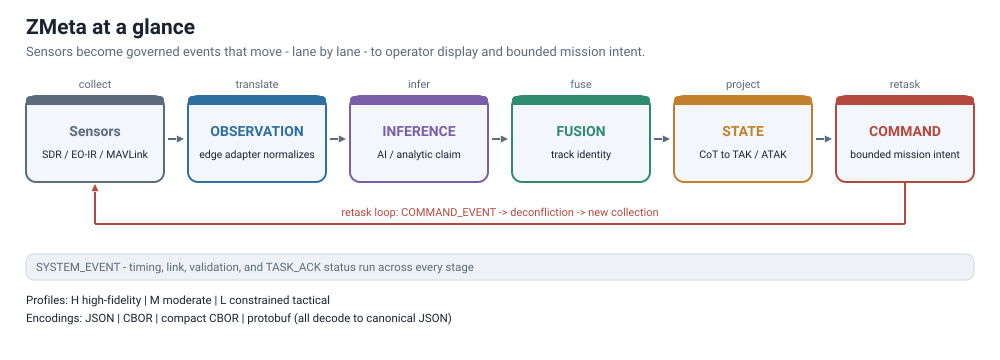

## Executive Summary

ZMeta is a transport-agnostic semantic metadata standard for resilient ISR,
edge sensing, tactical interoperability, and bandwidth-aware dissemination. It
does not replace CoT, MAVLink, JREAP, MISB, vendor sensor formats, or command
and control systems. Instead, it gives heterogeneous systems a shared language
for describing what was observed, what was inferred, what was fused into a
track, what state should be shown to an operator, and what mission intent is
being requested.

The core idea is simple: keep semantic truth explicit at every boundary.

An RF sensor line of bearing is not the same thing as a classified emitter. A
classifier result is not the same thing as a fused track. A fused track is not
the same thing as an operator display projection. A display projection is not
an unrestricted command basis. ZMeta makes those distinctions machine-checkable
so data can move across edge nodes, gateways, analytics, GCS software, TAK
clients, and downstream mission systems without silently changing meaning.

For leadership, ZMeta reduces integration risk. It lets teams add sensors,
adapters, AI models, gateways, and tactical views without creating a custom
data dialect for every mission thread.

For operators, ZMeta improves trust. It preserves lineage, timing quality,
confidence, accepted-risk labels, and command-safety boundaries so degraded or
externally promoted data does not look cleaner than it is.

For engineers, ZMeta provides a governed contract. The schema, policy pack,
adapters, gateway, encodings, conformance fixtures, release manifest, and tests
work together to keep implementations interoperable.

## The Problem ZMeta Solves

Modern ISR and edge autonomy stacks are built from systems that speak different
languages:

- SDRs report spectra, bearings, power levels, and capture files.
- EO/IR systems report frames, regions of interest, detections, and
  classifications.
- AI models report claims with model-specific confidence and provenance.
- Fusion engines create track identity and state estimates.
- GCS and TAK systems need compact operator-facing tracks.
- MAVLink and other platform interfaces execute tasking through their own
  safety and deconfliction layers.
- Bandwidth-constrained links need very small packets.
- Audit and after-action review need high-fidelity history.

Without a governed semantic layer, integration teams tend to collapse these
stages into whatever downstream interface is available. Common failure modes
include:

- raw observations being promoted directly into state;
- inferred labels being treated as measured facts;
- lossy external tracks re-entering the system as authoritative state;
- stale or degraded data being forwarded without visible risk labels;
- profile thinning removing lineage, confidence, TTL, or use limits;
- schema-valid messages bypassing producer authority, timing, or command
  safety policy;
- every adapter creating a private vocabulary that cannot interoperate.

ZMeta solves this by separating the semantic pipeline from the transport. It
defines stable event families, exact version dispatch, validation rules,
policy-enforced authority boundaries, profile projection rules, and adapter
obligations.

## Why ZMeta Is The Right Solution

ZMeta is intentionally strict where meaning matters and flexible where mission
configuration matters.

It is strict about:

- event identity and version dispatch;
- event-family separation;
- units, geodesy, and timing quality;
- confidence and uncertainty semantics;
- lineage for derived events;
- profile thinning without reinterpretation;
- producer authority and command safety;
- external promotion evidence;
- accepted-risk labels and use limits.

It is flexible through:

- deployment policy;
- profile selection;
- adapter mappings;
- namespaced extensions;
- gateway configuration;
- conformance classes;
- release-pinned baselines.

That split is the central design decision. ZMeta does not need to become a
complete mission ontology to be useful. It defines the load-bearing kernel that
prevents semantic corruption, then lets teams adapt the implementation through
policy, profiles, adapters, and extensions.

## What ZMeta Is

ZMeta is four things working together:

1. A semantic contract that defines what events mean.
2. A versioned schema that validates event structure.
3. A policy-driven enforcement model that handles runtime authority, timing,
   lineage, routing, risk, and command constraints.
4. A reference stack with gateways, adapters, encodings, examples, validators,
   conformance tests, and release tooling.

ZMeta is not:

- a transport;
- a raw data container;
- a replacement for TAK, CoT, MAVLink, JREAP, MISB, or vendor formats;
- a mutable object database;
- a safety-critical actuator protocol;
- a general C2 system.

The practical role of ZMeta is to normalize mission-relevant metadata so that
heterogeneous tools can exchange it without losing operational meaning.

## Core Semantic Pipeline

ZMeta models ISR information as events. Each event says what happened, who
produced it, when it happened, what it means, and how it relates to prior
events.

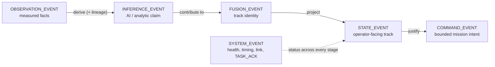

Each transition is a deliberate, evidence-bearing promotion: data only moves
to a higher-authority lane when lineage, timing, and confidence support it.

The primary event families are:

| Event family | Meaning | Typical producer |
| --- | --- | --- |
| `OBSERVATION_EVENT` | Measured facts from a sensor, such as RF bearing, power, EO metadata, acoustic facts, or network facts. | Edge sensor adapter |
| `INFERENCE_EVENT` | Analytic or AI claim derived from observations, such as classification, anomaly, association, or behavior. | Model or analytics node |
| `FUSION_EVENT` | Track association, track creation, identity continuity, or multi-source fusion. | Fusion service |
| `STATE_EVENT` | Current operator-facing track projection suitable for display or tactical export. | Gateway, fusion node, or authorized projection service |
| `COMMAND_EVENT` | Bounded mission intent that must pass command policy and out-of-band deconfliction before actuation. | Authorized command producer |
| `SYSTEM_EVENT` | Health, timing, link, task acknowledgement, validation, or diagnostic status. | Gateway, platform, adapter, validator |

This separation matters because each layer has different authority. A raw RF
line of bearing can support a future track estimate, but it is not itself a
track. A classifier can say "this looks like emitter class X," but it cannot
assign authoritative track identity. A track displayed in TAK is useful to an
operator, but it may still be prohibited from serving as an autonomy tasking
basis if timing, confidence, lineage, or promotion evidence is weak.

## Event Shape And Schema

The canonical validation entry point is:

```text
schema/zmeta-event.schema.json
```

That schema dispatches strictly by `zmeta_version`. A v1.0 event is validated
as v1.0. A v1.1.0 event is validated as the experimental v1.1.0 branch. Future
or v1.1.0-only vocabulary is not valid under `zmeta_version: "1.0"`.

A ZMeta event has a stable envelope:

```json
{
  "zmeta_version": "1.0",
  "event": {
    "event_id": "uuidv7",
    "event_type": "OBSERVATION_EVENT",
    "event_subtype": "RF",
    "ts": "2025-01-17T14:30:00Z"
  },
  "source": {
    "platform_id": "edge-node-1",
    "node_role": "EDGE",
    "producer": "rf-sensor-1",
    "sensor_id": "kraken-1"
  },
  "payload": {},
  "confidence": 0.82,
  "lineage": {
    "based_on": [],
    "transform": "translate:kraken@1.0.0"
  },
  "profile": "H"
}
```

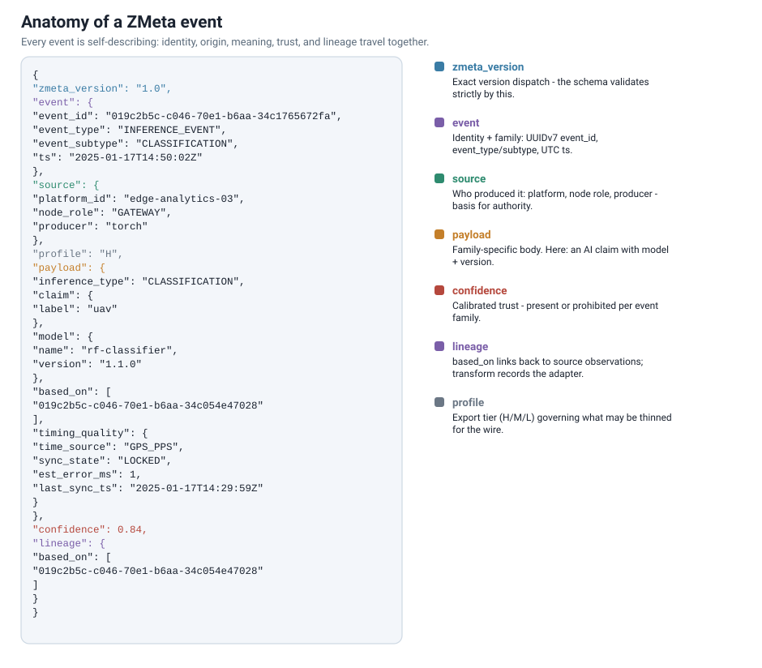

*Figure: identity, origin, meaning, trust, and lineage travel together in every
event. Rendered from the repo's own example events; see
`docs/diagrams/generate_figures.py`.*

The schema enforces structural and cross-field rules, including:

- exact version selection;
- UUIDv7 event identity shape;
- required envelope fields;
- event type and subtype vocabulary;
- subtype and payload discriminator matching;
- timestamp formatting with UTC trailing `Z`;
- confidence presence or prohibition by event type;
- profile/event-type compatibility when `profile` is present;
- required lineage for derived events;
- command payload restrictions;
- state payload restrictions.

Schema validation is necessary, but not sufficient. ZMeta also needs policy and
conformance because schema alone cannot prove producer authority, actual time
source quality, parent-event availability, command deconfliction, or whether a
lossy external track should be promoted into authoritative state.

## Semantic Boundaries

ZMeta is strict about what each event type may contain.

Observation events contain measured facts. RF observations can carry fields such
as center frequency, bandwidth, power, bearing, bearing uncertainty, and sensor
position. They do not assign track identity.

Inference events contain model or analytic claims. They carry confidence and
lineage to observations. They do not own track state.

Fusion events create or update track association and identity. They should make
clear which observations or inferences contributed to the fused result.

State events are compact operator-facing track projections. They may contain
track ID, geo, class, source summary, heading, speed, confidence, validity
window, and lineage. They must not contain raw observation features, raw
measurements, data references, or modality fields.

Command events carry bounded mission intent. They do not carry arbitrary
actuator controls and do not bypass platform deconfliction. In the reference
MAVLink egress path, a ZMeta command becomes a mission-intent object that a
separate deconfliction/control node can translate into MAVLink or another
platform API.

System events carry operational status, timing, link state, task acknowledgments,
policy diagnostics, schema violations, and health reports.

## Adapters

Adapters translate between native systems and ZMeta. They are semantic
boundaries, not just field mappers.

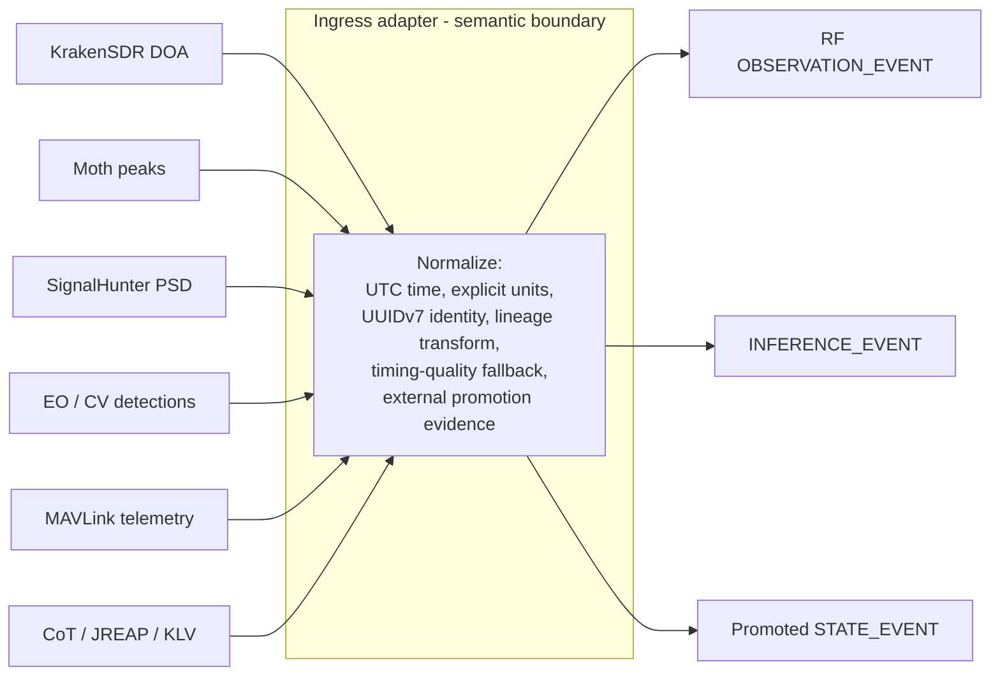

Ingress adapters convert native inputs into ZMeta:

| Native source | ZMeta output | Purpose |
| --- | --- | --- |
| KrakenSDR DOA output | RF `OBSERVATION_EVENT` | Line of bearing, frequency, power, quality metadata |
| Moth RF sensor output | RF `OBSERVATION_EVENT` | Peak frequency, power, optional bearing or wide uncertainty |
| SignalHunter PSD captures | RF `OBSERVATION_EVENT` | Power-gradient derived LOBs from spectrum sweeps |
| EO/CV detections | `INFERENCE_EVENT` | Classification or detection claims with model lineage |
| Decoded MISB KLV metadata | `OBSERVATION_EVENT` | EO/FMV sensor metadata from decoded KLV tags (not a STANAG 4609 parser) |
| MAVLink telemetry | `STATE_EVENT` and `SYSTEM_EVENT` | Platform state and status after safe projection |
| CoT, JREAP, vendor COP tracks | Promoted `STATE_EVENT` only with policy evidence | External tactical track promotion |

Egress adapters project ZMeta into external systems:

| ZMeta input | External output | Purpose |
| --- | --- | --- |
| `STATE_EVENT` | CoT XML | TAK/ATAK/WinTAK display interoperability |
| `STATE_EVENT` | JREAP-style track JSON | Program-of-record tactical gateway handoff |
| `OBSERVATION_EVENT` | KLV-style tag dictionary | Sensor-metadata projection for external video pipelines (not a STANAG 4609 binary encoder) |
| `COMMAND_EVENT` | MissionIntent JSON | Deconfliction node input before MAVLink or swarm API translation |

Adapters must preserve:

- event-family separation;
- UTC timestamp normalization;
- explicit units;
- ZMeta UUIDv7 event identity;
- lineage transforms;
- fallback timing quality when stronger source timing is unavailable;
- external promotion evidence when lossy tactical tracks become ZMeta state.

Native IDs, vendor quirks, and sensor-specific metadata belong in adapter-local
code, mapping packs, or safe namespaced extensions. They must not redefine core
ZMeta semantics.

## Gateway And Containerized Deployment

The reference gateway validates, policy-checks, profiles, encodes, forwards,
and optionally projects events to CoT. It is a role rather than a mandatory
network hop. The lightweight part - schema validation, profile projection, and
encoding - is cheap enough to run on the edge node itself, so a node can
normalize and emit validated ZMeta straight to fusion. The fuller policy pack
(producer authority, timing freshness, command safety, external promotion, and
contract-hash gates) is the gateway role; it can run co-located on that same
node or as a separate hop.

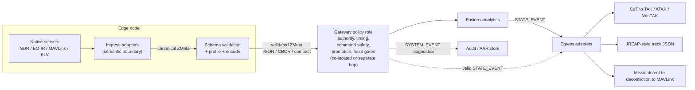

Typical gateway responsibilities are:

- accept UDP input in JSON, CBOR, compact CBOR, protobuf, or auto-detected
  formats;
- decode binary inputs back to canonical ZMeta JSON;
- validate the schema;
- enforce policy for roles, profiles, routing, producer authority, timing
  freshness, lineage, command safety, and external promotion;
- stamp non-semantic gateway timing fields where configured;
- enforce profile export behavior;
- deduplicate commands by task ID and emit `TASK_ACK` diagnostics;
- emit risk and validation diagnostics as `SYSTEM_EVENT` records;
- forward valid events to downstream systems;
- optionally emit CoT for valid `STATE_EVENT` tracks;
- enforce contract hash gates at startup when configured.

The reference deployment includes edge and gateway configuration files plus
Docker Compose helpers:

```text
configs/edge-config.json
configs/gateway-config.json
deploy/edge/docker-compose.yml
deploy/gateway/docker-compose.yml
```

In a fielded architecture, the gateway is a role, not necessarily a separate
hop. An edge node can run ingress adapters together with schema validation,
profile projection, and the gateway policy checks, then emit validated ZMeta
straight to fusion and analytics. The same enforcement can also be split across
a constrained link:
an edge container normalizes local sensors into ZMeta, applies a Profile L or M
export policy, and sends compact packets, while a downstream gateway container
decodes, validates, routes, forwards to analytics or tactical displays, and
emits CoT tracks for operator consumption. Either way, schema validation and
policy enforcement run before fusion; the topology only changes where they run,
not whether they happen.

The gateway is not the semantic authority. The semantic contract, schemas, and
policy pack define compliance. The gateway is the reference implementation that
shows how to enforce those rules.

## Bandwidth Efficiency Profiles

ZMeta supports three export profiles:

| Profile | Intended use | Allowed event types |
| --- | --- | --- |
| H | High-fidelity local, gateway, analytic, audit, or service links. | All event families |
| M | Moderate-bandwidth links that can carry observations, fusion, state, commands, and system events. | No inference export by default |
| L | Bandwidth-constrained tactical links. | State, system, and command events |

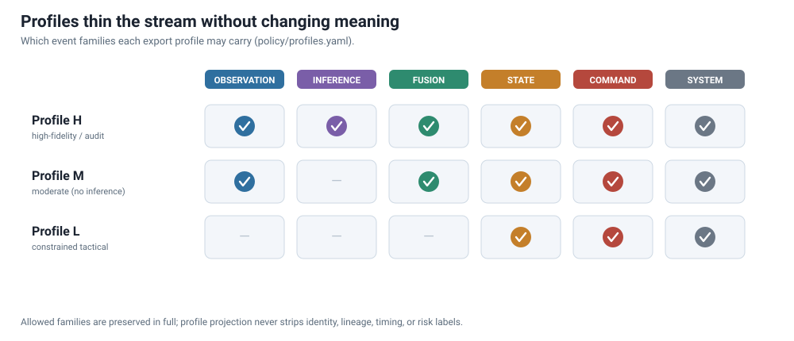

*Figure: which event families each profile may export, generated directly from
`policy/profiles.yaml`. Allowed families are still carried in full.*

Profiles thin data for export. They do not change meaning.

Profile projection must preserve:

- event identity;
- event time;
- source identity;
- semantic layer;
- track identity;
- lineage;
- units;
- timing semantics;
- confidence monotonicity;
- TTL monotonicity;
- required risk/use labels;
- external promotion evidence needed by policy.

Profile L may omit selected optional fields and reduce precision under policy,
but it must not strip required semantics or make degraded data look clean.

## Encodings: JSON, CBOR, Compact CBOR, And Protobuf

ZMeta separates event meaning from wire format.

| Encoding | Role | Best use |
| --- | --- | --- |
| JSON / JSONL | Canonical human-readable representation. | Debug, audit, examples, broad tooling |
| CBOR | Deterministic binary projection of the same event shape. | General binary transport |
| Compact CBOR | Integer-key Profile L mapping. | Low-bandwidth tactical links |
| Protobuf | Experimental typed envelope projection. | Service links, queues, gateway pipelines |

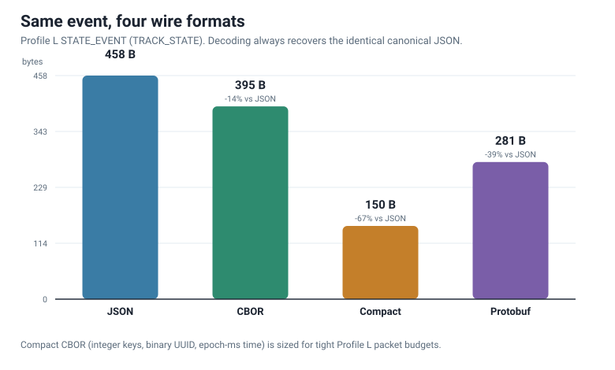

*Figure: the same Profile L `STATE_EVENT` across four wire formats. Byte counts
are measured with the repo encoders (`zmeta_cbor`, `zmeta_compact`,
`zmeta_proto`); every format decodes back to the identical canonical JSON.*

All encodings must decode to canonical ZMeta JSON before validation. Encoding
does not create authority. A compact or protobuf packet is valid only if the
decoded event passes the same schema, policy, and conformance expectations as a
JSON event.

The compact mapping reduces size by using integer keys, binary UUIDs, epoch
millisecond timestamps, and small enum codes. It is designed for Profile L
links where state, command, and system events need to fit inside tight packet
budgets.

Protobuf is experimental in the current release. It is useful for typed service
integration, but it does not replace the JSON schema or policy pack.

## Data Governance

ZMeta includes governance because interoperability is a lifecycle problem, not
only a schema problem.

The governance stack includes:

- the semantic contract;
- canonical schemas;
- policy YAML;
- extension registry;
- conformance class manifest;
- projection field catalog;
- conformance fixtures;
- validators and tests;
- release manifest hashes;
- release package validation;
- change governance for humans and AI agents.

The governance model protects several boundaries:

- v1.0 stays locked;
- v1.1.0 remains experimental and version-selected;
- future vocabulary is reserved or proposed until a versioned branch adopts it;
- registry entries alone do not make terms valid;
- conformance classes organize evidence but do not create semantics;
- downstream clone users can integrate locally, but local schema or semantic
  rewrites become private dialects unless governed and versioned.

Release manifests record hashes for governed artifact groups, including schema,
policy, extension registry, profile projection, conformance classes, encoding
negative suites, bad-event corpus, adapter harnesses, release tooling, and
process governance. Gateways can enforce contract hash gates so deployments do
not silently drift.

## Risk Adjudication And Accepted-Risk Filtering

ZMeta recognizes that operational deployments often accept imperfect data. A
stale timing source, unresolved parent event, lossy external promotion, or
degraded link may still be useful for display or AAR. It may not be safe for
fusion, command basis, autonomy, or coalition export.

The policy model supports bounded responses:

- `reject`
- `warn`
- `degrade`
- `quarantine`
- limited `ignore` for non-material checks only

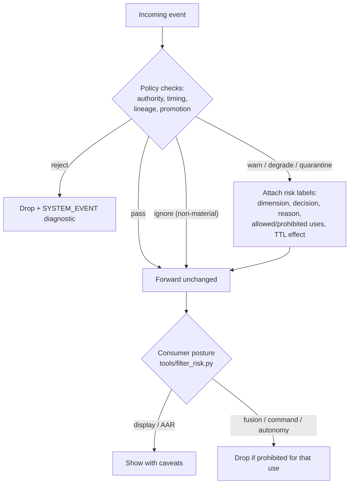

Soft acceptance must be explicit, auditable, and filterable. If a degraded or
quarantined event is forwarded, downstream consumers need labels such as:

- risk dimension;
- policy decision;
- reason code;
- allowed uses;
- prohibited uses;
- confidence or TTL effects;
- policy reference.

The `tools/filter_risk.py` utility lets consumers apply posture presets for
display, fusion, state update, command, autonomy, AAR, and audit intake. The
filter passes accepted events unchanged or drops them based on labels. It does
not rewrite risky data into clean data.

### Where these primitives are enforced

`payload.extensions.risk_adjudication` and
`payload.extensions.external_promotion` live in the extensions layer *above*
the locked v1.0 schema kernel, and that placement is deliberate, not an
oversight. Their enforcement home is the policy packs (`policy/*.yaml`), the
reference validators, the profile-projection preservation catalog, and the
kernel-conformance gates — not JSON Schema. This keeps the locked kernel
small and stable while the honesty semantics stay normative in the contract
(Sections 4.5.1 and 2.5) and machine-checked in conformance. The practical
consequence: a producer can emit a schema-valid event that omits or corrupts
these blocks, and it is *policy validation and conformance evidence* — not
schema rejection — that catches it. Deployments that need the guarantee must
therefore run policy validation, not schema validation alone. Promoting these
primitives into schema-level vocabulary is tracked as an evidence-gated
future-branch candidate in `spec/future-branch-roadmap.yaml`; it is not
planned absent field evidence that the policy-layer home is insufficient.

## AI Provenance

ZMeta gives edge AI output a disciplined place in the pipeline.

AI or analytic models should emit `INFERENCE_EVENT` records, not state. An
inference can include model name, model version, confidence, claim content, and
lineage back to observations. This lets operators and downstream systems see
which model produced a claim and what evidence it used.

Important boundaries:

- model confidence is not ground truth;
- model output does not create track identity by itself;
- track identity belongs to fusion;
- operator-facing state belongs to state projection;
- full model-runtime assurance, drift monitoring, and richer model status are
  future versioned work, not current v1.0 event vocabulary.

This is enough to support practical AI provenance today while keeping future
assurance concepts governed.

## Operational Scenario: RF Detection To Automated Retasking Workflow

The following scenario shows why ZMeta matters in a real mission thread.
It is one example, not the only use case.

ZMeta does not literally retask a drone by itself. It enables a larger
automation process because the systems in that process can exchange normalized,
validated, policy-labeled metadata and bounded mission intent. The GCS,
autonomy stack, deconfliction node, operator workflow, or platform control
system remains responsible for actual retasking and actuation.

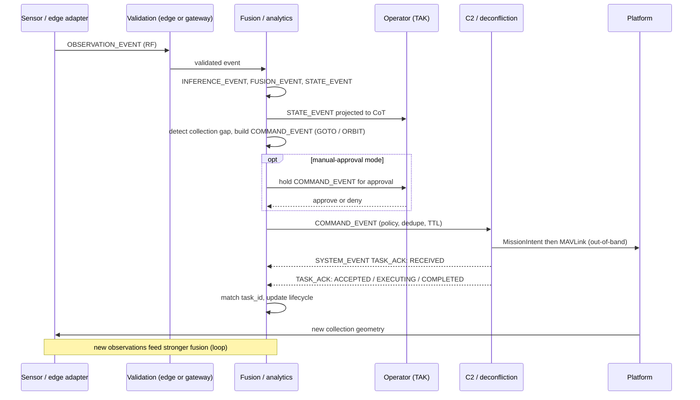

### 1. SDR or RF sensor captures emissions

A KrakenSDR, Moth sensor, SignalHunter, or other SDR-derived sensor detects an
emission. Native data may include center frequency, power, bearing, bearing
uncertainty, spectrum peaks, PSD sweeps, GPS position, or local capture
references.

The ingress adapter emits one or more RF `OBSERVATION_EVENT` records. The event
contains measured facts and timing quality. It does not claim target identity or
state by itself.

### 2. Analytics infer emitter behavior or class

An edge model or analytic service consumes RF observations. It may classify the
signal, detect anomaly patterns, correlate repeated peaks, or infer likely
emitter behavior.

That output becomes an `INFERENCE_EVENT` with model provenance and lineage back
to the source observations.

### 3. Fusion estimates track state

A fusion service combines multiple LOBs, power gradients, heat-map evidence,
prior observations, platform positions, and model outputs. It creates a
`FUSION_EVENT` for track association and a `STATE_EVENT` for the current
operator-facing track estimate.

The state event can carry geo, error ellipse, confidence, validity window,
source summary, and lineage. It should not carry raw PSD bins, raw IQ, or
observation feature blocks. Large captures stay in local stores or object
stores and are referenced where the versioned payload contract permits.

### 4. Gateway projects state to CoT

The gateway validates the ZMeta state and projects it to CoT. TAK, ATAK,
WinTAK, or a TAK Server can display the track with uncertainty, labels, remarks,
heading, speed, and stale time.

The operator or GCS sees a tactical track, but the ZMeta lineage still records
the chain from sensor observations through inference and fusion.

### 5. GCS, operator workflow, or mission logic requests retasking

If operators or mission logic want more collection, they should create a
bounded ZMeta `COMMAND_EVENT`, such as a GOTO, ORBIT, SEARCH_BOX, or future
version-selected RF scan task where supported. That command must satisfy
producer authority, routing, TTL, command safety, and deconfliction policy.

The reference MAVLink egress adapter converts a valid command event into a
MissionIntent object. A separate deconfliction and control node translates that
intent into MAVLink or another platform API out-of-band.

ZMeta does not directly fly the aircraft. It provides auditable mission intent
and preserves the reason the retasking was requested. That makes automation
practical because the metadata handoffs are consistent: RF observation,
inference, fusion, state projection, operator display, command intent, and
platform tasking can each remain in the right semantic lane.

### 6. Drone collects additional modality data

The retasked platform may collect more RF from a better geometry, perform a yaw
scan, capture EO/IR imagery, or cue another sensor. Those new observations enter
the same ZMeta pipeline.

The result is a closed evidence loop:

```text
RF observation -> inference -> fusion -> state -> CoT display
                -> command intent -> deconflicted platform tasking
                -> new RF/EO/IR observation -> stronger fusion
```

Each loop can increase confidence when evidence supports it. If evidence is
weak, stale, externally promoted, or degraded, ZMeta keeps that risk explicit.

## Additional Example Workflows

The SDR-to-retasking loop is only one pattern. The same semantic spine supports
many other interoperability workflows.

### Multi-Node RF Geolocation

Several RF sensors observe the same emitter from different positions. KrakenSDR
may provide high-quality DOA bearings, Moth may provide lower-fidelity peak
frequency and power, and SignalHunter may provide power-gradient bearings from
operator movement. Each adapter emits RF `OBSERVATION_EVENT` records with
explicit uncertainty and timing quality.

A fusion service can combine those observations into a track estimate and emit
`FUSION_EVENT` and `STATE_EVENT` outputs. Profile H consumers can retain the
full evidence chain, while Profile L consumers can receive compact state over a
constrained link without losing lineage or risk labels.

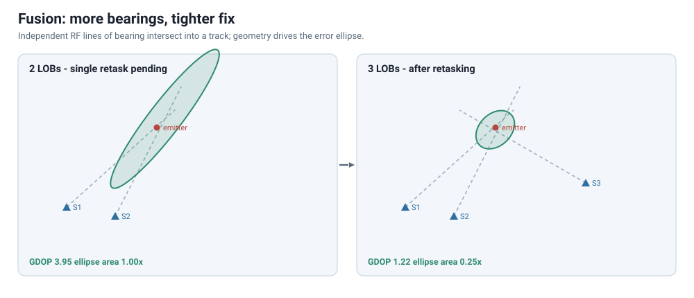

*Figure: geometry drives the fix. Two LOBs from a short baseline leave an
elongated error ellipse; retasking a platform to add a third bearing with a
stronger crossing angle shrinks the ellipse and lowers GDOP. This is the
fusion-plus-retasking loop the operational scenario describes.*

### RF-Cued EO Or IR Collection

An RF track may be good enough to cue additional collection but not good enough
for high-confidence identification. ZMeta can carry the RF evidence, fusion
estimate, and operator-facing state. A mission workflow can then request EO or
IR collection against the estimated area.

The follow-on EO/IR sensor produces new `OBSERVATION_EVENT` records. A detector
or classifier emits `INFERENCE_EVENT` records with model provenance. Fusion can
combine RF and EO/IR evidence into a stronger state estimate. The operator sees
whether confidence improved because the lineage and modality mix are explicit.

### Edge AI Triage To Operator Display

An edge model detects activity in video or image metadata. Instead of sending a
raw model-specific JSON blob directly to a COP, the adapter emits an
`INFERENCE_EVENT` with model name, version, confidence, claim content, and
lineage to observations.

A fusion or gateway service decides whether that inference contributes to a
track. Only the resulting `STATE_EVENT` is projected to CoT for TAK display.
This keeps AI claims visible and auditable without allowing a model output to
silently become authoritative state.

### GPS-Denied Or Timing-Degraded Operations

An edge node may operate with weak GPS, intermittent NTP, or stale timing
status. ZMeta requires timing quality metadata and policy can warn, degrade,
quarantine, or reject events depending on profile and mission posture.

That means a display consumer may still show degraded local awareness, while a
fusion or command-basis consumer can reject the same data. The event does not
need to be rewritten. Consumers choose posture from explicit labels.

### External Tactical Track Intake

A partner system may provide CoT, JREAP-style, MAVLink, or vendor COP state.
Those external tracks can be useful, but they are lossy projections and should
not automatically become authoritative ZMeta state.

ZMeta handles this with external promotion evidence. The adapter can emit a
`STATE_EVENT` only when policy-scoped promotion metadata and lineage transforms
make the boundary visible. Policy can reject, warn, degrade, or quarantine the
state. This prevents tactical tracks from laundering uncertainty as clean
native state.

### Low-Bandwidth Edge Dissemination

An edge node may collect high-fidelity observations locally but only have a
small radio link to the gateway. The node can keep Profile H data locally for
audit and send Profile L compact state, command, or system events across the
link.

The compact CBOR mapping reduces packet size, but the receiving gateway still
expands the event to canonical JSON and validates schema, policy, projection,
and risk behavior. Bandwidth efficiency does not weaken the semantic contract.

### Fleet Health, Timing, And Task Acknowledgement

ZMeta is not only for sensor detections. `SYSTEM_EVENT` records can report link
status, timing status, validation failures, and task acknowledgements. A
gateway can deduplicate commands and emit `TASK_ACK` events such as received,
accepted, rejected, executing, completed, failed, expired, or duplicate
ignored.

This gives operators and automation logic a common status stream that explains
what happened to a command or why an event was rejected.

### After-Action Review And Replay

Because ZMeta events are append-only and lineage-aware, the same stream can
support AAR and replay. Analysts can inspect which observations led to an
inference, which inferences contributed to fusion, what state was displayed,
what risk labels were present, and what command intent was generated.

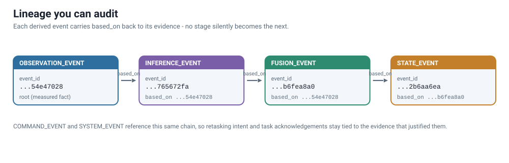

*Figure: a real `based_on` chain across the pipeline. Because lineage is
explicit, replay can reconstruct exactly which evidence justified each track and
command.*

Replay can preserve event time while gateways add receive/publish timestamps
for latency and workflow analysis.

### Vendor And Program Integration

A vendor can integrate by writing one ZMeta adapter instead of a custom adapter
for every downstream consumer. A program can evaluate that adapter against
conformance fixtures, bad-event tests, profile projection checks, and release
hashes.

The result is a cleaner acquisition and integration boundary: support the
contract, state the conformance class, provide evidence, and keep mission-
specific behavior in policy or namespaced extensions.

## What ZMeta Enables

ZMeta enables capabilities that are hard to build safely with point-to-point
adapters alone:

- SDR emissions can be normalized into a common RF observation format.
- Multiple RF sensors can contribute LOBs to a fusion engine without agreeing
  on a vendor-native message format.
- EO, IR, RF, acoustic, and network evidence can contribute to the same track
  pipeline while preserving modality-specific truth.
- Edge AI detections can be audited through model provenance and lineage.
- TAK users can receive CoT tracks without raw observation data being collapsed
  into state.
- GCS workflows can consume mission intent without treating ZMeta as an
  actuator protocol.
- Bandwidth-constrained nodes can send Profile L compact state while gateways
  preserve full validation semantics.
- Higher-bandwidth links can use JSON, CBOR, or protobuf depending on audit and
  service-integration needs.
- Gateways can enforce producer authority, timing quality, command dedupe, and
  contract hash gates.
- Operators can filter accepted-risk data differently for display, fusion,
  command, autonomy, and AAR.
- Release-pinned conformance gives vendors and integrators a repeatable target.

## Why Engineers Need It

Engineers need ZMeta because it replaces brittle one-off integrations with a
governed semantic contract.

Instead of writing every adapter directly to every consumer, teams write native
adapters into ZMeta and egress projections out of ZMeta. The center of the
system becomes stable:

```text
Native sensor -> ZMeta ingress -> validation/policy -> gateway/fusion
                                      -> ZMeta egress -> CoT/MAVLink/JREAP/etc.
```

That pattern improves testability. Engineers can validate examples, run
conformance suites, test bad-event rejection, measure packet size, convert
encodings, and prove profile projection behavior.

It also improves maintainability. New sensors usually require an adapter, not a
new ecosystem-wide data model.

## Why Operators Need It

Operators need ZMeta because it keeps data honest.

An operator should know whether a track is based on fresh RF bearings, stale
external CoT state, unresolved lineage, low-confidence AI inference, or
high-quality multi-source fusion. ZMeta does not force one display or one risk
posture. It makes the facts and policy decisions available so the mission can
choose an appropriate posture.

For example, a degraded track might be acceptable for local awareness but
blocked from autonomous tasking. A quarantined external report might be useful
for AAR but prohibited as a command basis. ZMeta preserves those distinctions.

## Why Leadership Needs It

Leadership needs ZMeta because it reduces integration, interoperability, and
audit risk.

ZMeta creates a repeatable contract that vendors, internal teams, and mission
integrators can target. It supports incremental adoption: start with a sensor
adapter and gateway, add profile-aware links, add CoT projection, add fusion,
then add command-intent workflows under policy.

The value is not only technical. It gives leadership a way to ask concrete
questions:

- Which conformance classes does this implementation claim?
- Which release is it pinned to?
- Which policies authorize producer and command behavior?
- What happens when timing is stale?
- Can accepted-risk data reach autonomy or command basis?
- Which fields are preserved under Profile L?
- Which adapters have shared harness evidence?
- Which future concepts are still non-claimable?

That is the difference between an integration demo and an interoperable,
governed capability.

## Adoption Pattern

A practical adoption path is:

1. Pin to a release, currently v1.1.9 for the formal baseline.
2. Validate existing examples and conformance locally.
3. Add one ingress adapter for the first sensor or data source.
4. Run schema and policy validation at the gateway boundary.
5. Select Profile H, M, or L based on link and consumer needs.
6. Choose JSON, CBOR, compact CBOR, or protobuf as the wire projection.
7. Add CoT, JREAP, or mission-intent egress as needed.
8. Configure producer authority, routing, timing, and risk policies.
9. Add focused tests and shared adapter-harness fixtures for new mappings.
10. Use conformance classes and release hashes to prove what is supported.

## Key Implementation Surfaces

| Surface | Path | Role |
| --- | --- | --- |
| Semantic contract | `spec/semantics-contract.md` | Normative meaning |
| Canonical schema | `schema/zmeta-event.schema.json` | Version-dispatched validation |
| v1.0 schema | `schema/zmeta-event-1.0.schema.json` | Locked v1.0 validation |
| v1.1.0 schema | `schema/zmeta-event-1.1.0.schema.json` | Experimental, version-selected validation |
| Policy pack | `policy/` | Runtime enforcement |
| Gateway | `gateway/src/gateway.py` | Reference validation and forwarding |
| Ingress adapters | `adapters/ingress/` | Native to ZMeta |
| Egress adapters | `adapters/egress/` | ZMeta to external systems |
| Profiles | `policy/profiles.yaml` | Export/event legality |
| Compact mapping | `spec/compact-binary-mapping.md` | Profile L packet efficiency |
| Protobuf mapping | `spec/protobuf-encoding.md` | Experimental service projection |
| Conformance fixtures | `conformance/` | Regression and interoperability evidence |
| Release manifest | `release/zmeta-release-manifest.yaml` | Governed artifact hashes |
| Change governance | `docs/zmeta_change_governance.md` | Maintainer and agent process |

## Current Limits And Future Work

ZMeta v1.1.9 intentionally does not claim everything.

Current limits include:

- v1.0 is locked and normative;
- v1.1.0 remains experimental and version-selected;
- protobuf remains an experimental encoding projection;
- literal raw IQ support remains future work pending representative sensor
  data and a versioned adapter contract;
- broader native sensor-adapter certification remains future harness breadth;
- detached release signatures require an approved release-authority signing
  process;
- future trust, event signing, PNT integrity, UAS identity, coalition export,
  model assurance, projection-origin metadata, and data nutrition labels remain
  future versioned work unless and until adopted through governance.

Those limits are strengths. They keep the current baseline honest and prevent
future concepts from becoming accidental current vocabulary.

## Bottom Line

ZMeta is the semantic spine for resilient ISR integration. It lets teams move
from sensor data to AI claims, fused tracks, tactical display, and bounded
mission intent while preserving meaning, lineage, timing, confidence, risk, and
authority.

It gives engineers a stable contract, operators a trustworthy data posture, and
leadership a governed path from prototype integration to repeatable capability.
